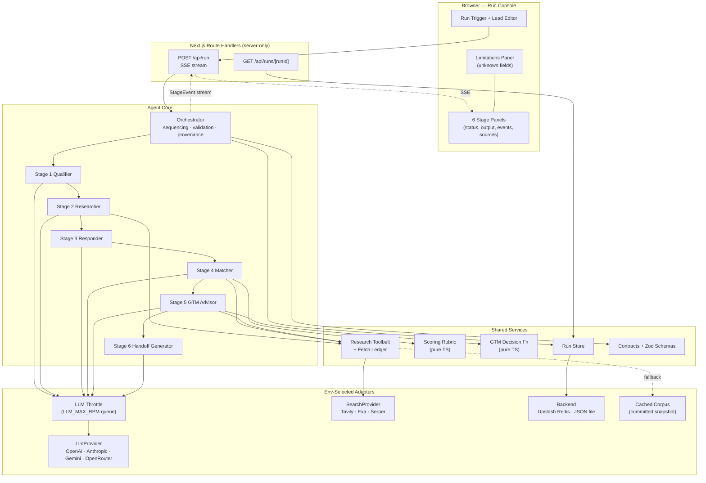
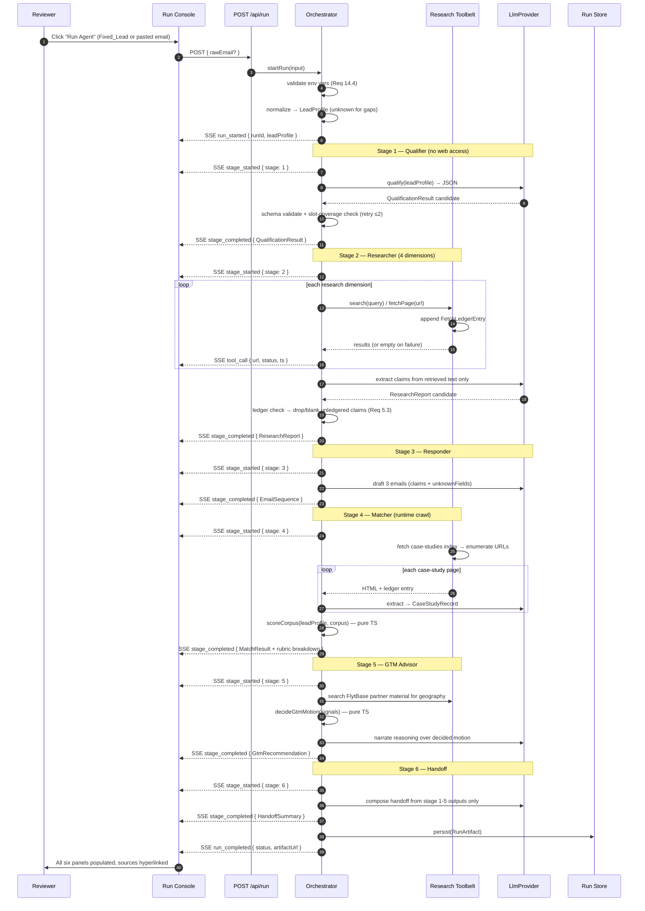
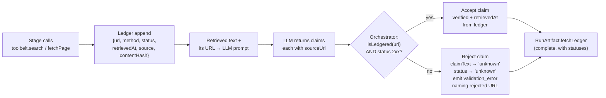

# Design Document

## Overview

The Inbound BDR Agent is a single Next.js 15 (App Router) TypeScript application that consumes one raw inbound contact-form email and autonomously produces six artifacts in a single triggered run: a framework-based qualification, a live-sourced account research report, a three-email adaptive response sequence, a runtime-discovered case-study match, a GTM motion recommendation, and an AE handoff summary.

The system is built as a **deterministic sequential pipeline of six typed stage modules** driven by a thin orchestrator. Each stage module is a separate source file whose filename states its stage number and purpose, so the submission writeup can cite one file per stage. The orchestrator owns sequencing, event emission, contract validation, provenance enforcement, and persistence. Stage modules own only their own logic and their own scoped LLM call. All web access — search and page fetch — is funneled through a single shared Research Toolbelt that maintains a per-run **fetch ledger**.

Two constraints from the hackathon brief drive most of the design:

1. **Fabrication is an automatic disqualifier.** The design answers this with a mechanical, non-negotiable control rather than a prompt instruction: the Research Toolbelt records every URL it requests along with response status and timestamp, and the orchestrator rejects any claim whose `sourceUrl` is not present in that ledger with a success status. An LLM cannot smuggle a plausible-looking URL past this check, because the check does not consult the LLM. Anything unverifiable resolves to the literal string `"unknown"`.

2. **No hardcoded matching logic.** Stage 4 (case-study match) and Stage 5 (GTM motion) are computed in plain deterministic TypeScript from a weighted rubric over `LeadProfile` fields and `CaseStudyRecord` fields. There is no branch keyed to a company name, an email address, or a referral organization. The case-study corpus itself is crawled from `flytbase.com` at runtime; a self-built cached snapshot is a labeled fallback that marks affected records `stale`.

The only hardcoded lead data anywhere in the repository is the fixed demo lead (Rodrigo Castillo / SQM), held in one constants file and used only as the default run input.

### Key Design Decisions Summary

| Decision | Choice | Rationale |
| --- | --- | --- |
| Framework | Next.js 15 App Router + TypeScript | One repo serves UI and API from one public URL (Req 15.4) |
| Hosting | Render web service | Long-lived SSE connection, no hard request cap (Req 15.6) |
| Agent shape | Deterministic pipeline of 6 typed stages | Stage traceability (Req 13.1), enforceable per-stage output contracts |
| Scoring | Plain TypeScript, LLM excluded | Determinism, auditability, no company-name branching (Req 8.8) |
| Anti-fabrication | Orchestrator-enforced fetch ledger | Mechanical, not prompt-dependent (Req 5.3) |
| Providers | Env-selected adapters (LLM / Search / Store) | API keys not yet finalized; swap with no code change |
| Streaming | Server-Sent Events + artifact re-read fallback | Observable long run, recoverable stream (Req 12.2, 12.5) |

## Architecture

### Runtime Shape



### End-to-End Run Sequence



### Architecture Decision: Why Not One Agent With Tools, and Why Not a Multi-Agent Swarm

Three shapes were considered for the agent layer.

**Option A — Single agent with a tool loop.** One LLM conversation holding a system prompt describing all six deliverables, with `web_search`, `fetch_page`, and `emit_artifact` tools, looping until done.

Rejected for three concrete reasons:
- **Stage boundaries become invisible in the trace.** Requirement 11 demands per-stage inputs, tool calls, reasoning, and outputs. In a single tool loop, "which stage is this tool call for?" is a post-hoc guess derived from the model's own narration, not a structural fact. Requirement 11.1 and 11.3 (stage-start and stage-complete events with the stage name and complete stage output) cannot be emitted reliably.
- **Output shape is unenforceable per stage.** Requirement 17.4 requires retrying a *specific stage* at most twice when its output fails contract validation. A single conversation has one output surface; a malformed email sequence and a malformed qualification result are indistinguishable failure modes, and retrying means replaying the whole expensive loop.
- **The "point to Stage N's file" requirement fails.** Requirement 13.1 and 13.6 require six separate named source files and a README table mapping stage to path. A single agent has one file and one prompt; the mapping would be fictional.

**Option B — Autonomous multi-agent swarm.** Six (or more) agents with a coordinator negotiating work, delegating, and possibly re-planning.

Rejected because the value proposition does not apply here:
- **The stage DAG is genuinely fixed.** Qualification must precede the email sequence (emails target unknown fields). Research must precede emails and handoff. Matching must precede handoff. The GTM motion must precede the suggested next step. There is no branching plan for a planner to discover — the plan is the requirements document.
- **Non-determinism adds cost and flakiness without benefit.** Delegation negotiation burns extra LLM calls on a run already budgeted at 60–180 seconds, and a swarm can decide to skip a dimension, producing runs where Requirement 4.1 (at least one request per research dimension) silently fails.
- **Reproducibility for a demo matters.** A reviewer re-running the demo should see the same six stages in the same order. A swarm's trace differs run to run, which weakens rather than strengthens the "inspectable reasoning" story.

**Chosen — Option C: deterministic sequential pipeline of typed stages.**
- Six modules each implementing the same `Stage<TInput, TOutput>` interface, wired in a fixed array by a thin orchestrator (~200 lines: loop, validate, emit, retry, persist).
- The LLM is confined to what it is genuinely good at, inside each stage: **extraction** (retrieved HTML → structured claims / case-study records) and **synthesis** (structured facts → prose).
- **All scoring and all decisions are plain deterministic TypeScript.** Match scores, priority score arithmetic, and the direct-vs-partner motion are computed by pure functions over typed fields. This is what makes Requirement 8.8 ("no conditional branch keyed to a specific company name") a statement that can be verified by reading one small file, and what makes Requirement 8.7 (lead-attribute sensitivity) testable at all.
- Trade-off accepted: the pipeline cannot adapt its own plan. That is the correct trade for a fixed-DAG deliverable with a hard auditability requirement.

### Deployment Decision: Render Over Vercel

A single run performs, in sequence: 4+ live search calls, a multi-page crawl of `flytbase.com` (index page plus N case-study pages), a partner-material search, and six-plus LLM calls. Measured realistically that is **60–180 seconds of wall time**, dominated by network latency and LLM generation, not CPU.

- **Vercel Hobby** caps serverless function duration at a level below this run's realistic worst case, and streaming does not exempt the function from the cap. A run that dies at the cap mid-Stage-4 produces exactly the kind of half-artifact the brief penalizes.
- **Render web services** run as a long-lived Node process behind a proxy that sustains an open connection for the life of the response. There is no per-request duration ceiling to design around, so the SSE stream can stay open for the whole run and Requirement 15.6 is satisfied by the second clause ("stream Stage_Events over a connection that the hosting platform sustains for the Run duration").

Consequences documented and accepted:
- Render free-tier instances **cold-start after idle** (roughly 50 seconds to wake). The README instructs a reviewer to open the URL once, let it wake, then trigger the run. A completed-run permalink (`/runs/{runId}`) exists precisely so a reviewer can see a full artifact without waiting on a live run.
- A single long-lived process means in-flight run state can live in process memory for the duration of the stream, with the durable artifact written at the end. Requirement 16.5 is satisfied by the Upstash Redis backend, not by process memory.
- Node runtime, not Edge: the crawl and HTML parsing use Node APIs.

### Provider Abstraction

API keys are not finalized, so every external dependency sits behind an interface with multiple implementations selected by environment variable **at deploy time with no code change**.

| Interface | Implementations | Selector env var | Key env var |
| --- | --- | --- | --- |
| `LlmProvider` | `openai`, `anthropic`, `gemini`, `openrouter` | `LLM_PROVIDER` | `OPENAI_API_KEY` / `ANTHROPIC_API_KEY` / `GEMINI_API_KEY` / `OPENROUTER_API_KEY` |
| `SearchProvider` | `tavily`, `exa`, `serper` | `SEARCH_PROVIDER` | `TAVILY_API_KEY` / `EXA_API_KEY` / `SERPER_API_KEY` |
| `RunStore` backend | Upstash Redis, local JSON file | implicit (see below) | `UPSTASH_REDIS_REST_URL` + `UPSTASH_REDIS_REST_TOKEN` |

**Run store selection is implicit rather than flag-driven:** if both Upstash env vars are present, the Redis backend is used; otherwise the process falls back to a local JSON file store under `.data/runs/`. The JSON fallback is **development-only and does not survive a redeploy** — Render's filesystem is ephemeral. This means Requirement 16.5 (persistence surviving redeployment) is satisfied **only** when the Upstash variables are configured. Startup validation therefore emits a loud warning, and the Run Console shows a "runs are not durable in this environment" badge, when the fallback is active.

**Startup validation** runs in `src/lib/config/env.ts` at module load and again as the orchestrator's first action:
- Parse `process.env` through a Zod schema that resolves the selector vars first, then requires only the key for the selected provider (choosing `anthropic` does not require an OpenAI key).
- Unknown selector value → fail fast with the list of legal values.
- Missing required key at run trigger → per Requirement 14.4, the run is marked `failed` immediately and a `validation_error` StageEvent names the missing variable (name only, never a value).
- All config access goes through this module. No stage reads `process.env` directly, which is what keeps Requirement 14.6 (no secret in browser code) structurally true: the config module has no client entry point and is imported only from server files.

#### OpenRouter: a Fourth Selector Value, Not a Fourth Adapter

OpenRouter speaks the OpenAI Chat Completions API, so adding it as a **new adapter file would duplicate code for no reason**. Instead `src/providers/llm/openai.ts` is parameterized by `{ baseUrl, apiKey, model, extraHeaders }`, and the factory in `src/providers/llm/index.ts` constructs it twice with different parameters:

| `LLM_PROVIDER` | Base URL | Key | Extra headers |
| --- | --- | --- | --- |
| `openai` | `https://api.openai.com/v1` (SDK default) | `OPENAI_API_KEY` | none |
| `openrouter` | `https://openrouter.ai/api/v1` | `OPENROUTER_API_KEY` | `HTTP-Referer`, `X-Title` |

`HTTP-Referer` and `X-Title` are **attribution only** — OpenRouter uses them to credit the calling app on its public leaderboards. They carry no secret, are optional, and their absence changes no behavior. The adapter's `name` is the selector value (`"openrouter"`), so `providerConfig.llmProvider` in the artifact reports which configuration ran rather than reporting `"openai"` for both (Req 14.5 still holds: names only, never keys).

New environment variables:

| Variable | Required when | Default | Purpose |
| --- | --- | --- | --- |
| `OPENROUTER_API_KEY` | `LLM_PROVIDER=openrouter` | — | Bearer key for the OpenRouter gateway |
| `OPENROUTER_MODEL` | no | `google/gemma-4-31b-it:free` | Primary model slug |
| `OPENROUTER_FALLBACK_MODEL` | no | `google/gemma-4-26b-a4b-it:free` | Secondary model, tried only after primary exhausts schema retries |
| `OPENROUTER_APP_URL` | no | — | Sent as `HTTP-Referer` (attribution) |
| `OPENROUTER_APP_TITLE` | no | — | Sent as `X-Title` (attribution) |

**Only the selected provider's key is required.** `openrouter` joins the existing rule unchanged: selecting it requires `OPENROUTER_API_KEY` and requires nothing from OpenAI, Anthropic, or Gemini. The env schema resolves `LLM_PROVIDER` first, then demands exactly one key.

**Model decision — why `google/gemma-4-31b-it:free` and not `openai/gpt-oss-20b:free`.** Every stage output in this pipeline is Zod-validated at the `completeJson` boundary, so structured-output reliability is not a nice-to-have — it is the difference between a run completing and a stage burning its whole retry budget. The free `openai/gpt-oss-20b` endpoint reports a **~34% structured-output error rate**, which is incompatible with schema validation on every single stage output; at that rate a six-stage run would statistically lose multiple stages to validation failure. Gemma 4 31B's free endpoint (served via Google AI Studio) reports a **0.49% tool-call error rate** and the **best instruction-following score among the free candidates**, exposes `response_format` so JSON mode is available rather than prompt-simulated, and carries a **262K context window** — which matters concretely here because Stage 2 and Stage 4 prompts carry full retrieved page text, not summaries.

**Caveat, stated plainly:** Gemma 4 31B's *structured-output* error rate is **unreported**, not measured-low. The 0.49% figure is a tool-call metric, which is correlated but not identical. That gap is exactly why `OPENROUTER_FALLBACK_MODEL` exists — the design does not assume the primary model is reliable, it assumes it is probably reliable and keeps a second path.

**Fallback model semantics (deliberately narrow):**
- The fallback is attempted **only after the primary model has exhausted its schema-validation retries** — it is not a load-balancing or latency mechanism.
- The fallback attempt **counts inside the existing bounded-retry budget** of Requirement 17.4 rather than extending it. A stage still gets at most three LLM invocations total; the fallback simply changes which model serves the last one. This preserves Property 36 exactly as written.
- A `llm_call` StageEvent with `fallbackModelUsed: true` is emitted when the fallback serves an attempt, so the trace shows which model produced the accepted output.
- If the fallback also fails validation, the stage is marked `failed` and its output becomes `"unknown"` — the ordinary degradation path, no new failure mode.

#### LLM Call Throttle (`src/providers/llm/throttle.ts`)

OpenRouter's free tier allows **50 requests/day** (1,000/day after a one-time $10 credit purchase) at **20 requests/minute**. One run issues roughly **15–25 LLM calls** — six stage calls, four Stage 2 dimension extractions, up to `CRAWL_MAX_PAGES` Stage 4 per-page extractions, plus retries. The Stage 4 extraction loop alone can therefore trip the per-minute ceiling, since it fires one call per crawled page in quick succession.

So all LLM adapters — not just OpenRouter — route their outbound calls through a single client-side throttle:

```typescript
export interface LlmThrottle {
  /** Queues fn and runs it when a request slot is free. Preserves submission order. */
  schedule<T>(purpose: string, fn: () => Promise<T>): Promise<T>;
}

export function createLlmThrottle(opts: {
  maxRpm: number;                          // LLM_MAX_RPM, default 20
  now: () => number;                       // injected clock (testability)
  sleep: (ms: number) => Promise<void>;
  emit: (event: ThrottleEvent) => void;
}): LlmThrottle;
```

Behavior:
- A FIFO queue with a sliding 60-second window of call start timestamps. A call is released only when fewer than `LLM_MAX_RPM` starts fall inside the trailing window; otherwise it waits until the oldest start ages out. Submission order is preserved, so Stage 4's page loop degrades into a slower loop rather than a burst of 429s.
- `LLM_MAX_RPM` (default `20`) governs it. Setting it lower is the correct lever for a paid tier with tighter limits; setting it higher is the lever for a self-hosted model.
- **This is not the Research Toolbelt's politeness delay.** The toolbelt delay governs HTTP egress to third-party web pages and search APIs; the throttle governs *model calls*. They are separate counters with separate budgets, and neither substitutes for the other. An LLM call routed through the toolbelt would be a design error, and the existing lint rule that confines `fetch` to `src/research/` and `src/providers/` keeps the two egress paths distinct.
- On a `429` or any rate-limit response, the adapter reads `Retry-After` (seconds or HTTP-date form) and waits that long **before** entering the existing exponential backoff, rather than backing off blindly against a server that already told us when to return. A missing or unparseable `Retry-After` falls straight through to the existing backoff.
- A `llm_call` StageEvent is emitted when a call is queued behind the throttle (`throttled: true`, with the wait) and when it backs off after a rate-limit response (`rateLimited: true`, with the honored delay). Waiting is visible in the trace, so a reviewer watching a slow Stage 4 can see it is throttling rather than hanging.
- **Rate-limit exhaustion is not a new failure mode.** When retries and honored delays are exhausted — daily cap hit, for instance — the call fails like any other LLM failure: the stage is marked `failed`, its output becomes exactly `"unknown"`, the run becomes `partial`, and nothing is invented to fill the gap. Requirement 17.6 applies unchanged.

| Variable | Required | Default | Purpose |
| --- | --- | --- | --- |
| `LLM_MAX_RPM` | no | `20` | Client-side ceiling on LLM requests per rolling minute, across all adapters |

### Repository Layout

```
src/
  app/
    page.tsx                          # Run Console (Req 12.1)
    runs/[runId]/page.tsx             # Shareable stored run (Req 16.2)
    api/
      run/route.ts                    # POST — trigger + SSE stream (Req 2.2, 12.2)
      runs/[runId]/route.ts           # GET  — stored RunArtifact (Req 16.2, 16.3)
  agent/
    orchestrator.ts                   # Req 13.2 — sequencing, validation, provenance
    stages/
      stage-1-qualifier.ts            # Req 3
      stage-2-researcher.ts           # Req 4
      stage-3-responder.ts            # Req 6
      stage-4-matcher.ts              # Req 7, 8
      stage-5-gtm-advisor.ts          # Req 9
      stage-6-handoff-generator.ts    # Req 10
    stages/stage-4/
      case-study-extractor.ts         # crawl + parse → CaseStudyRecord
      case-study-serializer.ts        # canonical serialize (Req 7.4, 7.5)
      scoring-rubric.ts               # pure weighted scoring (Req 8.1)
    stages/stage-5/
      gtm-decision.ts                 # pure motion decision (Req 9.6)
    contracts.ts                      # Req 13.5 — all shared types
    schemas.ts                        # Zod schemas mirroring contracts
    lead-normalizer.ts                # raw email → LeadProfile (Req 1.3, 1.4)
    fixed-lead.ts                     # ONLY hardcoded lead data (Req 1.1)
  research/
    toolbelt.ts                       # Req 13.3, 13.4 — sole web egress
    fetch-ledger.ts                   # provenance ledger (Req 5.3, 5.4)
    cached-corpus/                    # committed snapshot + manifest.json (Req 7.6)
  providers/
    llm/{index.ts,openai.ts,anthropic.ts,gemini.ts}
                                      # openai.ts is parameterized by base URL +
                                      # key, so `openrouter` reuses it (no new file)
    llm/throttle.ts                   # shared RPM queue for all LLM adapters
    search/{index.ts,tavily.ts,exa.ts,serper.ts}
  store/
    run-store.ts                      # interface + selection
    upstash-run-store.ts
    json-file-run-store.ts
  lib/config/env.ts                   # env parsing + startup validation (Req 14.1)
  components/
    RunTrigger.tsx  LeadEditor.tsx  RunStatusBar.tsx
    StagePanel.tsx  StageEventLog.tsx  SourceLink.tsx
    LimitationsPanel.tsx  StreamInterruptedNotice.tsx
    stage-views/{Stage1View..Stage6View}.tsx
  hooks/useRunStream.ts               # SSE consumption + reconnect
tests/
  properties/*.property.test.ts
  unit/*.test.ts
.env.example                          # Req 14.3
README.md                             # Req 15.2, 15.3, 13.6
```

## Components and Interfaces

### Orchestrator (`src/agent/orchestrator.ts`)

The orchestrator is deliberately thin. It knows nothing about qualification frameworks, HTML, or scoring rubrics. Its responsibilities:

1. **Env validation** — first action; on a missing required variable, mark run `failed` and emit a naming StageEvent (Req 14.4).
2. **Lead normalization** — call `normalizeLead(rawEmail ?? FIXED_LEAD)`; missing fields become `"unknown"` (Req 1.2–1.4).
3. **Run identity** — mint a `runId` (`run_${ULID}`), sortable and collision-free (Req 2.6).
4. **Sequencing** — iterate the fixed `STAGES` array in order 1→6, building a `StageContext` from prior outputs (Req 2.1, 2.3).
5. **Contract validation with bounded retry** — validate each stage output against its Zod schema; on failure re-invoke the stage with the validation error appended to the prompt, at most twice; then mark the stage `failed` (Req 17.4).
6. **Provenance enforcement** — after Stage 2 and Stage 5, cross-check every claim's `sourceUrl` against the fetch ledger; reject unledgered claims and emit a `validation_error` naming the URL (Req 5.3).
7. **Degradation** — on stage failure, substitute `"unknown"` for the missing upstream output, continue, and set run status `partial` (Req 2.5).
8. **Event fan-out** — every StageEvent goes to both the SSE sink and the in-memory event array that becomes part of the artifact (Req 11.6).
9. **Persistence** — write the `RunArtifact` on `complete` or `partial` (Req 2.4, 16.1).

```typescript
export interface OrchestratorOptions {
  rawEmail?: RawEmailRecord;          // absent → FIXED_LEAD (Req 1.2)
  onEvent: (event: StageEvent) => void; // SSE sink
}

export async function runPipeline(
  options: OrchestratorOptions
): Promise<RunArtifact>;
```

Stage wiring is a literal array, which is what makes the pipeline order auditable at a glance:

```typescript
const STAGES = [
  stage1Qualifier,
  stage2Researcher,
  stage3Responder,
  stage4Matcher,
  stage5GtmAdvisor,
  stage6HandoffGenerator,
] as const;
```

### Stage Module Interface

Every stage implements one interface (`Stage<TOutput>`), which is why the orchestrator can treat all six identically. Each stage declares which upstream outputs it depends on, so the dependency graph is data rather than control flow (Req 2.3).

Stage dependency declarations:

| Stage | File | Depends on | Uses toolbelt |
| --- | --- | --- | --- |
| 1 Qualifier | `stage-1-qualifier.ts` | LeadProfile | no |
| 2 Researcher | `stage-2-researcher.ts` | LeadProfile, QualificationResult | yes |
| 3 Responder | `stage-3-responder.ts` | LeadProfile, QualificationResult, ResearchReport | no |
| 4 Matcher | `stage-4-matcher.ts` | LeadProfile | yes |
| 5 GTM Advisor | `stage-5-gtm-advisor.ts` | LeadProfile, QualificationResult, MatchResult | yes |
| 6 Handoff | `stage-6-handoff-generator.ts` | all of stages 1–5 | no |

### Stage 1 — Qualifier (`stage-1-qualifier.ts`)

No web access. One LLM call constrained to a JSON schema, plus deterministic post-processing.

- Framework choice is made by the LLM from `MEDDPICC | BANT | SPICED`, with a justification required to cite at least two `LeadProfile` attributes (Req 3.1, 3.2). Validation counts attribute references before accepting.
- **Slot coverage is enforced deterministically, not trusted.** The module holds a static slot table per framework (e.g. MEDDPICC → `metrics, economicBuyer, decisionCriteria, decisionProcess, paperProcess, identifiedPain, champion, competition`). After the LLM returns `knownFields`, the module computes `unknownFields = ALL_SLOTS − keys(knownFields)` by set difference. This makes Requirement 3.8 (union covers every slot exactly once) true by construction rather than by hope, and it is the invariant the corresponding property test exercises.
- `priorityScore` is clamped to 0–100 and each contributing factor is named with its point delta (Req 3.5, 3.6). `fitAssessment` is derived from score bands (`≥70 strong_fit`, `40–69 moderate_fit`, `<40 weak_fit`) so the label can never contradict the number.

### Stage 2 — Researcher (`stage-2-researcher.ts`)

Four dimensions are researched, each with at least one toolbelt call (Req 4.1): `org_structure`, `budget_signals`, `recent_news`, `leadership_language`. `positioning` is synthesized from the claims of the other four rather than searched.

Per-dimension flow:
1. Build queries from `LeadProfile` fields only — company, country, industry, title, division. Query templates are attribute-interpolated (e.g. `"{company}" investor relations capital expenditure`), never company-specific strings.
2. `toolbelt.search(query)` → candidate URLs; `toolbelt.fetchPage(url)` for the top N (N=3) → text.
3. One LLM extraction call per dimension whose prompt contains **only the retrieved text plus its URL**, with the instruction that every claim must quote a supporting span from that text. The LLM never receives an instruction to "find" facts, only to extract them.
4. Any dimension with zero retrieved text yields exactly one claim with `claimText: "unknown"` and `verificationStatus: "unknown"` (Req 4.8).
5. `retrievedAt` is stamped from the ledger entry, not from the model (Req 4.9).
6. Numeric-figure claims must carry the URL of the page the figure came from; the extraction prompt requires a `numericFigures[]` list and validation rejects a numeric claim with no URL (Req 5.6).

The `positioningRecommendation` is a set of assertion objects, each carrying `supportingClaimIds: string[]` with length ≥ 1; assertions failing that check are dropped (Req 4.6).

### Stage 3 — Responder (`stage-3-responder.ts`)

No web access. Deterministic pre-planning followed by one LLM generation call.

- The module **assigns** unknown-field coverage before generating: it partitions `qualification.unknownFields` across the three emails, 1–2 per email, greedily prioritizing high-information slots (economic buyer, decision process, metrics), guaranteeing ≥3 distinct fields across the sequence (Req 6.3, 6.4). Determinism here means the coverage requirement is met by arithmetic, not by asking the model nicely.
- Each email must reference ≥1 verified claim id; validation checks `referencedClaimIds` against the report (Req 6.2).
- `progressionRationale` is required on emails 2 and 3, null on email 1 (Req 6.5).
- `personaAdaptationNote` describes the tone/technical-depth adjustment for an operations-leader persona (Req 6.6).
- If the report has zero `verified` claims, the module switches to a lead-facts-only prompt and sets `researchUnavailableNotice` (Req 6.7).

### Stage 4 — Matcher (`stage-4-matcher.ts`)

Three collaborating files.

**`case-study-extractor.ts`** — fetches the FlytBase case-studies index at runtime, extracts anchor hrefs, filters to same-origin case-study paths, dedupes, caps at a configured maximum (`CRAWL_MAX_PAGES`, default 12), fetches each page, and runs one LLM extraction per page into a `CaseStudyRecord`. Absent fields become `"unknown"` (Req 7.1–7.3). Every request and status becomes a StageEvent (Req 7.8).

Fallback chain (Req 7.6, 7.7):
- Live index fetch fails → load `src/research/cached-corpus/`, set every affected record's `verificationStatus: "stale"`, emit a StageEvent carrying the snapshot timestamp from `manifest.json`.
- Live fails and no cached corpus → stage status `failed`, `matchResult` set to `"unknown"`.

**`case-study-serializer.ts`** — canonical serialization with a fixed field order, `"unknown"` for absent values, and a matching parser. `parse(serialize(record))` is required to equal `record`, which is a property test (Req 7.5).

**`scoring-rubric.ts`** — the pure scoring core, detailed in its own section below.

Stage output includes the ranked corpus, winner, runner-up, per-dimension breakdown for both, and a comparison statement naming at least one dimension where the winner exceeded the runner-up (Req 8.3–8.5). Corpus size < 2 → emit what exists, runner-up `"unknown"`, StageEvent stating corpus size (Req 8.9).

### Stage 5 — GTM Advisor (`stage-5-gtm-advisor.ts`)

1. Toolbelt search against FlytBase public material for partner-ecosystem signals in the lead's geography, using geography-interpolated queries (Req 9.1).
2. `gtm-decision.ts` computes the motion deterministically from typed signals (detailed below).
3. One LLM call **narrates the already-decided motion**, referencing geography, deal complexity, and the presence or absence of regional partner evidence (Req 9.3). The LLM cannot change the decision — the motion field is written by the pure function after generation.
4. `partner_led` requires `partnerType` and the supporting FlytBase `sourceUrl` (Req 9.4); the URL is ledger-checked like any other.
5. No partner signal retrieved → `regionalPartnerEvidence: "unknown"` plus an explicit `derivedWithoutPartnerEvidence: true` flag surfaced in the UI (Req 9.5).

### Stage 6 — Handoff Generator (`stage-6-handoff-generator.ts`)

No web access. The prompt is assembled **exclusively** from stage 1–5 outputs, and validation rejects any handoff string containing a URL not present in the run's claim/case-study URL set (Req 10.6).

- Top-three findings are selected deterministically: verified claims ranked by dimension priority then by presence of a numeric figure, take three (Req 10.3).
- Fewer than three verified claims → remaining entries `"unknown"` plus a stated count of available verified findings (Req 10.7).
- The suggested next step is templated on the Stage 5 motion so it cannot contradict it (Req 10.5).

### Research Toolbelt (`src/research/toolbelt.ts`)

The **only** module in the codebase permitted to make outbound web calls (Req 13.4). Enforced by convention plus a lint rule banning `fetch`/`axios` imports outside `src/research/` and `src/providers/`.

```typescript
export interface ResearchToolbelt {
  search(query: string, opts?: { maxResults?: number }): Promise<SearchHit[]>;
  fetchPage(url: string): Promise<FetchedPage | null>;
  getLedger(): readonly FetchLedgerEntry[];
  isLedgered(url: string): boolean;
}
```

Behavior:
- Per-request timeout via `AbortController` (`REQUEST_TIMEOUT_MS`, default 15000). Timeout → abort, `tool_error` StageEvent, return empty/null (Req 17.2).
- Non-success status → StageEvent with URL and status, return empty/null (Req 17.1). No throwing into stage code; degradation is the default path.
- HTML → text via a lightweight readability pass; scripts, styles, and nav stripped; truncated to a token budget before reaching the LLM.
- A simple politeness delay and a per-run request cap protect against runaway crawls.
- Every call, success or failure, appends a `FetchLedgerEntry` **before** returning.

### Source URL Provenance Mechanism (Req 5.3, 5.4)

This is the anti-fabrication control and the single most important mechanism in the design.



Details that make it hold:
- The ledger is a **per-run, append-only** array owned by the toolbelt instance created at run start. It cannot be written by stage code; the toolbelt appends on its own call path.
- URLs are **normalized before comparison** (lowercase scheme and host, strip default port, strip trailing slash, strip fragment, drop tracking query params) so a trivially-reformatted URL cannot bypass the check and a legitimately-identical URL is not falsely rejected.
- Redirects are recorded as separate ledger entries for both the requested and the final URL, so a claim citing either resolves.
- A ledgered URL with a non-2xx status **does not** satisfy the check — being requested is not enough (Req 4.7 requires a success response).
- `retrievedAt` on an accepted claim is copied from the ledger entry, never from the model, so timestamps cannot be invented either (Req 4.9).
- The full ledger, including failed requests and their status codes, is serialized into the artifact (Req 5.4) and rendered in the UI.
- The same check runs on Stage 5's `partnerEvidenceUrl` and Stage 4's `caseStudy.sourceUrl`.

### Stage 4 Scoring Rubric (`stages/stage-4/scoring-rubric.ts`)

A pure function. No LLM, no network, no company names.

```typescript
export const RUBRIC_WEIGHTS = {
  industry: 0.35,
  geography: 0.25,
  useCase: 0.30,
  partnerOverlap: 0.10,
} as const;   // sums to exactly 1.0
```

Each dimension is a pure function returning a normalized `0.0–1.0` sub-score. Every one of them compares a `LeadProfile` field against a `CaseStudyRecord` field. `"unknown"` on either side scores `0.0` and is reported as `unknownInput: true` rather than being silently treated as a mismatch.

| Dimension | Weight | Lead input | Case-study input | Computation |
| --- | --- | --- | --- | --- |
| `industry` | 0.35 | `leadProfile.industry` | `record.industry` | Normalized-token Jaccard overlap, plus a shared-taxonomy-parent bonus using a generic industry taxonomy (`mining ⊃ lithium extraction ⊃ hard-rock mining`). Exact normalized equality → 1.0. |
| `geography` | 0.25 | `leadProfile.country` (+ region hints in `statedUseCase`) | `record.region` | Tiered: exact country match 1.0; same continent/sub-region via a generic region table 0.6; different 0.0. Tiers come from a country→region map, not from a lead-specific branch. |
| `useCase` | 0.30 | `leadProfile.statedUseCase` + `statedPainPoints` | `record.useCase` + `record.statedResults` | Token-overlap over a lemmatized domain vocabulary (inspection, patrol, stockpile, survey, thermal, autonomous, 24/7, safety), weighted by IDF across the corpus so common words contribute less. |
| `partnerOverlap` | 0.10 | `leadProfile.referralSource` | `record.namedPartner` | 1.0 exact normalized org-name match; 0.5 token-level partial match; 0.0 no overlap or either side `"unknown"`. Compares two *fields*, so it works for any referral org. |

```
matchScore = Σ (weight_d × subScore_d)    for d in {industry, geography, useCase, partnerOverlap}
```

Because every weight is non-negative, weights sum to 1.0, and every sub-score is clamped to `[0,1]`, the result is provably in `[0.0, 1.0]` (Req 8.6). Final rounding is to 4 decimals with a re-clamp so floating-point drift cannot produce `1.0000000002`.

**Company-name agnosticism (Req 8.8):** the file contains no string literal naming a company, a person, an email address, or a referral organization. The generic taxonomy and region tables are keyed by industry and geography terms only. A unit test greps the compiled rubric and GTM modules for the fixed lead's identifying strings and fails if any appear.

**Attribute sensitivity (Req 8.7):** because every sub-score reads a lead attribute, changing `industry` or `country` necessarily changes at least the corresponding dimension contribution unless both values map to the same normalized bucket. This is a property test.

**Breakdown surfacing (Req 8.3):** each `MatchResult` entry carries a `ScoreBreakdown` with, per dimension, the raw sub-score, the weight, the weighted contribution, the lead value used, the case-study value used, and the reason string. Stage 4's UI panel renders this as a table for winner and runner-up, so the arithmetic is visible rather than asserted.

### Stage 5 GTM Decision Function (`stages/stage-5/gtm-decision.ts`)

A pure function over typed inputs; no LLM, no company names.

```typescript
export interface GtmDecisionInputs {
  leadCountry: string;                    // or "unknown"
  leadRegion: string;                     // derived from generic country→region map
  isHeadquartersRegion: boolean;          // lead region ∈ vendor direct-coverage regions (config)
  complexitySignals: {
    siteCount: number | "unknown";        // parsed from stated use case
    continuousOperations: boolean;        // "24/7" style signals
    regulatedEnvironment: boolean;        // mining / energy / aviation-regulated context
    multiStakeholder: boolean;            // ≥2 unknown decision-role slots from Stage 1
    dealSizeIndicator: "small" | "mid" | "large" | "unknown"; // from site count + priority score
  };
  partnerEvidence: {
    found: boolean;
    partnerNames: string[];
    partnerTypeHints: string[];
    sourceUrl: string | null;             // must be ledgered
  };
}
```

Deterministic decision:

```
complexityScore =
    (siteCount >= 3            ? 2 : siteCount >= 2 ? 1 : 0)
  + (continuousOperations      ? 1 : 0)
  + (regulatedEnvironment      ? 1 : 0)
  + (multiStakeholder          ? 1 : 0)
  + (dealSizeIndicator=large   ? 2 : dealSizeIndicator=mid ? 1 : 0)

motion =
  partnerEvidence.found AND NOT isHeadquartersRegion AND complexityScore >= 3
    → partner_led
  partnerEvidence.found AND NOT isHeadquartersRegion AND complexityScore < 3
    → partner_led            // local delivery capacity matters more than deal size out-of-region
  NOT partnerEvidence.found AND NOT isHeadquartersRegion
    → direct_ae with derivedWithoutPartnerEvidence = true   (Req 9.5)
  isHeadquartersRegion
    → direct_ae
```

`partnerType` is classified when the motion is `partner_led`, by matching retrieved partner-page text against generic category vocabularies:

| `Partner_Type` | Indicative retrieved-text vocabulary |
| --- | --- |
| `systems_integrator` | integration, deployment, end-to-end, SI |
| `drone_service_provider` | drone-as-a-service, flight operations, pilot services |
| `hardware_reseller` | reseller, distributor, authorized dealer |
| `industrial_automation_consultancy` | automation consulting, industrial IoT advisory |

Highest vocabulary-hit count wins; a tie or zero hits yields `"unknown"`. Every input is an attribute or a retrieved-evidence field, so Requirement 9.6 (derived from attributes, not from the company name) holds structurally.

### Run Store (`src/store/`)

```typescript
export interface RunStore {
  put(artifact: RunArtifact): Promise<void>;
  get(runId: string): Promise<RunArtifact | null>;
  list(limit?: number): Promise<RunSummary[]>;
  readonly isDurable: boolean;   // false for the JSON fallback
}
```

- `UpstashRunStore` — REST-based Redis; key `run:{runId}`, value the JSON-serialized artifact, plus a capped `runs:index` sorted set. Durable across redeploys (Req 16.5).
- `JsonFileRunStore` — one file per run under `.data/runs/{runId}.json`, `isDurable: false`. Dev only; explicitly does **not** satisfy Req 16.5, and the README and UI both say so.
- Serialization goes through the same Zod schema used for validation, so `deserialize(serialize(a))` equals `a` — a property test (Req 16.4). Dates are ISO-8601 strings in the contract types precisely to keep that round-trip exact.
- `get` on an unknown id returns `null`; the route returns 404 and the console renders a run-not-found notice (Req 16.3).

### SSE Streaming Design

**Route contract — `POST /api/run`**

- Request body: `{ rawEmail?: RawEmailRecord }`. Absent → fixed lead (Req 1.2, 1.6, 12.7).
- Response: `200` with `Content-Type: text/event-stream`, `Cache-Control: no-cache, no-transform`, `Connection: keep-alive`, `X-Accel-Buffering: no` (prevents proxy buffering, which would otherwise defeat Req 12.2).
- Body: a `ReadableStream` fed by the orchestrator's `onEvent` sink. The handler runs on the Node runtime and awaits `runPipeline` to completion before closing.
- A `: heartbeat` comment frame every 15 seconds keeps intermediaries from idling the connection out during a long Stage 4 crawl.
- Each event is emitted as a named SSE event with a monotonically increasing `id`:

```
id: 42
event: stage_event
data: {"seq":42,"runId":"run_01J...","type":"tool_call", ...}
```

Event types: `run_started`, `stage_started`, `tool_call`, `tool_error`, `reasoning`, `validation_error`, `unknown_substitution`, `stage_completed`, `stage_failed`, `run_completed`.

**Interruption handling (Req 12.5)**

The `useRunStream` hook tracks `lastSeq`. On `error` / unexpected close:
1. Render a stream-interrupted notice with the elapsed time and last stage seen.
2. Offer two controls: **Reload results** (`GET /api/runs/{runId}`, which renders the full artifact if the run finished server-side) and **Retry stream**.
3. The run continues server-side regardless of the browser — the orchestrator is not driven by the client — so an interrupted stream never corrupts a run. This is the reason results are recoverable rather than lost.
4. Because events carry `seq`, replayed or duplicated events are deduped client-side by `seq`.

**UI state transitions (Req 12.3, 12.4, 12.6)**

Client state is a reducer over the event sequence: six `StagePanel`s each in `pending → running → complete | failed`, plus run status `running → complete | partial | failed`. `stage_started` flips a panel to running with a spinner; `tool_call` events append to that panel's live event log; `stage_completed` renders the typed output view in place with no reload. Panels are independently expandable and labelled with stage number and name (Req 11.4, 11.5). Framework justification, rubric breakdown, and progression rationale render as plain visible text, never behind a debug toggle (Req 11.7). `SourceLink` renders each URL as a real anchor with the fetch status and timestamp on hover (Req 5.5). `LimitationsPanel` enumerates every dimension and field that resolved to `"unknown"` for this run (Req 5.7).

## Data Models

All types below live in `src/agent/contracts.ts` (Req 13.5) and are mirrored one-to-one by Zod schemas in `src/agent/schemas.ts`. The Zod schemas are the single source of truth for LLM output validation, route input validation, and store serialization.

Two conventions run through every type:
- **`Unknown` is a literal type, not `null`.** `type Unknown = "unknown"` and `type Maybe<T> = T | Unknown`. Making it a literal string means "we could not verify this" survives JSON serialization, renders directly in the UI, and cannot be confused with "not yet computed".
- **All timestamps are ISO-8601 strings**, not `Date` objects, so serialize/deserialize round-trips are exact (Req 16.4).

### Primitives

```typescript
export const UNKNOWN = "unknown" as const;
export type Unknown = typeof UNKNOWN;
export type Maybe<T> = T | Unknown;

export type IsoTimestamp = string;   // ISO-8601 UTC

export type StageNumber = 1 | 2 | 3 | 4 | 5 | 6;
export type StageStatus = "pending" | "running" | "complete" | "failed";
export type RunStatus = "running" | "complete" | "partial" | "failed";
export type VerificationStatus = "verified" | "unknown" | "stale";
export type ResearchDimension =
  | "org_structure"
  | "budget_signals"
  | "recent_news"
  | "leadership_language"
  | "positioning";
```

### Lead Input and Profile

```typescript
export interface RawEmailRecord {
  fromName: string;
  fromEmail: string;
  subject: string;
  body: string;
  receivedAt?: IsoTimestamp;
  formFields?: Record<string, string>;   // arbitrary contact-form extras
}

export interface LeadProfile {
  leadId: string;
  senderName: Maybe<string>;
  senderEmail: Maybe<string>;
  title: Maybe<string>;
  division: Maybe<string>;
  company: Maybe<string>;
  companyDomain: Maybe<string>;
  country: Maybe<string>;
  region: Maybe<string>;              // generic country→region map
  industry: Maybe<string>;
  statedUseCase: Maybe<string>;
  statedPainPoints: string[];         // [] when none stated
  referralSource: Maybe<string>;      // "Anglo American" for Fixed_Lead (Req 1.5)
  statedTimeline: Maybe<string>;      // Q3 budget conversation for Fixed_Lead (Req 1.5)
  siteCount: Maybe<number>;
  rawEmail: RawEmailRecord;
  normalizedAt: IsoTimestamp;
}
```

### Stage 1 — Qualification

```typescript
export type QualificationFramework = "MEDDPICC" | "BANT" | "SPICED";
export type FitAssessment = "strong_fit" | "moderate_fit" | "weak_fit";

export interface FrameworkSlot {
  slotId: string;                     // e.g. "economicBuyer"
  slotLabel: string;                  // e.g. "Economic Buyer"
}

export interface KnownField {
  slotId: string;
  slotLabel: string;
  value: string;
  sourceLeadField: keyof LeadProfile; // which LeadProfile field supplied it (Req 3.3)
  evidenceQuote: string;              // verbatim span from the lead email
}

export interface UnknownField {
  slotId: string;
  slotLabel: string;
  whyItMatters: string;
}

export interface ScoreFactor {
  factor: string;
  contribution: number;               // signed points
  explanation: string;
}

export interface QualificationResult {
  framework: QualificationFramework;
  frameworkSlots: FrameworkSlot[];              // full slot set for the framework
  frameworkSelectionJustification: string;
  justificationLeadAttributes: (keyof LeadProfile)[];  // length >= 2 (Req 3.2)
  knownFields: KnownField[];
  unknownFields: UnknownField[];
  priorityScore: number;                        // integer 0..100 (Req 3.5)
  scoreFactors: ScoreFactor[];                  // (Req 3.6)
  scoreReasoning: string;
  fitAssessment: FitAssessment;                 // (Req 3.7)
}
```

Invariant enforced in code and by property test: `{slotId of knownFields} ⊎ {slotId of unknownFields} = {slotId of frameworkSlots}`, disjoint, no duplicates (Req 3.8).

### Stage 2 — Research

```typescript
export interface NumericFigure {
  label: string;
  value: string;                      // kept as string to preserve units/format
  sourceUrl: string;                  // required (Req 5.6)
}

export interface ResearchClaim {
  claimId: string;                    // "claim_<dimension>_<n>", referenced by stages 3 and 6
  dimension: ResearchDimension;
  claimText: Maybe<string>;           // UNKNOWN when unverified (Req 5.2)
  sourceUrl: Maybe<string>;           // ledgered URL when verified (Req 4.7)
  supportingQuote: Maybe<string>;     // span from the retrieved page
  retrievedAt: Maybe<IsoTimestamp>;   // from the ledger (Req 4.9)
  verificationStatus: VerificationStatus;
  numericFigures: NumericFigure[];
  rejectionReason?: string;           // set when provenance check rejected it (Req 5.3)
}

export interface PositioningAssertion {
  assertion: string;
  supportingClaimIds: string[];       // length >= 1 (Req 4.6)
}

export interface PositioningRecommendation {
  narrative: string;
  assertions: PositioningAssertion[];
}

export interface ResearchReport {
  claims: ResearchClaim[];
  claimsByDimension: Record<ResearchDimension, string[]>;   // dimension → claimIds
  positioningRecommendation: PositioningRecommendation;
  dimensionsWithNoSource: ResearchDimension[];              // feeds LimitationsPanel (Req 5.7)
  verifiedClaimCount: number;
}
```

### Stage 3 — Email Sequence

```typescript
export interface EmailDraft {
  position: 1 | 2 | 3;
  subject: string;
  body: string;
  referencedClaimIds: string[];             // length >= 1 (Req 6.2)
  targetedUnknownSlotIds: string[];         // length 1..2 (Req 6.3)
  sendTimingGuidance: string;               // e.g. "Day 0", "Day 3"
  progressionRationale: Maybe<string>;      // UNKNOWN for position 1 (Req 6.5)
}

export interface EmailSequence {
  emails: [EmailDraft, EmailDraft, EmailDraft];       // exactly 3 (Req 6.1)
  coveredUnknownSlotIds: string[];                    // >= 3 distinct (Req 6.4)
  personaAdaptationNote: string;                      // (Req 6.6)
  researchUnavailableNotice: Maybe<string>;            // set per Req 6.7
}
```

### Stage 4 — Case Studies and Matching

```typescript
export interface CaseStudyRecord {
  sourceUrl: string;
  title: Maybe<string>;
  industry: Maybe<string>;
  region: Maybe<string>;
  useCase: Maybe<string>;
  namedPartner: Maybe<string>;
  statedResults: Maybe<string>;
  verificationStatus: VerificationStatus;   // "stale" when from Cached_Corpus (Req 7.6)
  retrievedAt: Maybe<IsoTimestamp>;
}

export type RubricDimension = "industry" | "geography" | "useCase" | "partnerOverlap";

export interface DimensionScore {
  dimension: RubricDimension;
  weight: number;                  // from RUBRIC_WEIGHTS
  subScore: number;                // 0.0..1.0
  contribution: number;            // weight * subScore
  leadValue: Maybe<string>;        // exactly what was compared (Req 8.1)
  caseStudyValue: Maybe<string>;
  unknownInput: boolean;
  reason: string;
}

export interface ScoreBreakdown {
  dimensions: DimensionScore[];    // one per RubricDimension (Req 8.3)
  matchScore: number;              // 0.0..1.0 (Req 8.6)
}

export interface ScoredCaseStudy {
  record: CaseStudyRecord;
  breakdown: ScoreBreakdown;
  rank: number;                    // 1-based
}

export interface MatchResult {
  corpusSize: number;
  rankedCorpus: ScoredCaseStudy[];              // (Req 8.4)
  winner: Maybe<ScoredCaseStudy>;
  runnerUp: Maybe<ScoredCaseStudy>;             // UNKNOWN when corpus < 2 (Req 8.9)
  comparisonStatement: Maybe<string>;           // (Req 8.5)
  decidingDimensions: RubricDimension[];
  rubricWeights: Record<RubricDimension, number>;
  corpusProvenance: "live" | "cached" | "unavailable";
  cachedSnapshotAt: Maybe<IsoTimestamp>;        // (Req 7.6)
}
```

### Stage 5 — GTM Recommendation

```typescript
export type GtmMotion = "direct_ae" | "partner_led";

export type PartnerType =
  | "systems_integrator"
  | "drone_service_provider"
  | "hardware_reseller"
  | "industrial_automation_consultancy"
  | Unknown;

export interface PartnerEvidence {
  found: boolean;
  partnerNames: string[];
  sourceUrl: Maybe<string>;          // ledgered FlytBase URL (Req 9.4)
  supportingQuote: Maybe<string>;
  retrievedAt: Maybe<IsoTimestamp>;
}

export interface ComplexityAssessment {
  complexityScore: number;
  signals: {
    siteCount: Maybe<number>;
    continuousOperations: boolean;
    regulatedEnvironment: boolean;
    multiStakeholder: boolean;
    dealSizeIndicator: "small" | "mid" | "large" | Unknown;
  };
  explanation: string;
}

export interface GtmRecommendation {
  motion: GtmMotion;                           // (Req 9.2)
  reasoning: string;                           // geography + complexity + partner (Req 9.3)
  geographyConsidered: Maybe<string>;
  complexity: ComplexityAssessment;
  regionalPartnerEvidence: Maybe<PartnerEvidence>;   // UNKNOWN per Req 9.5
  derivedWithoutPartnerEvidence: boolean;            // (Req 9.5)
  partnerType: Maybe<PartnerType>;                   // required when partner_led (Req 9.4)
  decisionInputsSnapshot: Record<string, string | number | boolean>;  // audit trail
}
```

### Stage 6 — Handoff Summary

```typescript
export interface HandoffFinding {
  claimId: Maybe<string>;
  finding: Maybe<string>;
  sourceUrl: Maybe<string>;          // (Req 10.3)
}

export interface HandoffSummary {
  buyerContext: string;
  qualificationStatus: {
    framework: QualificationFramework;
    priorityScore: number;
    fitAssessment: FitAssessment;
    knownFieldCount: number;                   // (Req 10.2)
    unknownSlotLabels: string[];
  };
  topThreeFindings: [HandoffFinding, HandoffFinding, HandoffFinding];  // (Req 10.3)
  verifiedFindingsAvailable: number;           // (Req 10.7)
  recommendedCaseStudy: {
    sourceUrl: Maybe<string>;
    title: Maybe<string>;
    whyItWon: Maybe<string>;                   // (Req 10.4)
  };
  suggestedNextStep: {
    action: string;
    rationale: string;
    consistentWithMotion: GtmMotion | Unknown; // (Req 10.5)
  };
}
```

### Provenance, Events, and Artifact

```typescript
export interface FetchLedgerEntry {
  entryId: string;
  runId: string;
  stage: StageNumber;
  kind: "search" | "page_fetch";
  requestedUrl: string;               // for search: the provider endpoint
  finalUrl: Maybe<string>;            // after redirects
  normalizedUrl: string;              // key used by isLedgered()
  query: Maybe<string>;               // search query text
  statusCode: Maybe<number>;          // UNKNOWN on network error/timeout
  ok: boolean;
  errorKind: Maybe<"timeout" | "network" | "http_error" | "parse_error">;
  retrievedAt: IsoTimestamp;
  contentBytes: Maybe<number>;
  contentHash: Maybe<string>;         // sha256 of extracted text
}

export type StageEventType =
  | "run_started"
  | "stage_started"
  | "tool_call"
  | "tool_error"
  | "reasoning"
  | "llm_call"
  | "validation_error"
  | "unknown_substitution"
  | "stage_completed"
  | "stage_failed"
  | "run_completed";

export interface StageEvent {
  seq: number;                        // monotonic per run; SSE dedupe key
  eventId: string;
  runId: string;
  stage: StageNumber | null;          // null for run-level events
  stageName: string | null;
  type: StageEventType;
  timestamp: IsoTimestamp;
  message: string;
  inputSummary?: string;              // (Req 11.1)
  toolCall?: {                        // (Req 11.2)
    kind: "search" | "page_fetch";
    urlOrQuery: string;
    statusCode: Maybe<number>;
    retrievedAt: IsoTimestamp;
  };
  llmCall?: {
    provider: string;
    model: string;                    // the model that actually served the call
    purpose: string;
    promptTokens: Maybe<number>;
    completionTokens: Maybe<number>;
    attempt: number;
    fallbackModelUsed?: boolean;      // true when OPENROUTER_FALLBACK_MODEL served it
    throttled?: boolean;              // true when the call waited on the RPM queue
    throttleWaitMs?: number;
    rateLimited?: boolean;            // true when a 429 forced a backoff
    retryAfterMs?: Maybe<number>;     // honored Retry-After, UNKNOWN when absent
  };
  stageStatus?: StageStatus;
  output?: unknown;                   // complete stage output on stage_completed (Req 11.3)
  rejectedUrl?: string;               // on validation_error (Req 5.3)
  substitutedField?: string;          // on unknown_substitution (Req 17.5)
  durationMs?: number;
}

export interface StageRecord<T> {
  stage: StageNumber;
  stageName: string;
  sourceFile: string;                 // e.g. "src/agent/stages/stage-1-qualifier.ts" (Req 13.1)
  status: StageStatus;
  attempts: number;
  startedAt: Maybe<IsoTimestamp>;
  completedAt: Maybe<IsoTimestamp>;
  durationMs: Maybe<number>;
  output: T | Unknown;                // UNKNOWN when the stage failed (Req 2.5)
  failureReason: Maybe<string>;
}

export interface RunArtifact {
  schemaVersion: 1;
  runId: string;
  status: RunStatus;
  startedAt: IsoTimestamp;
  completedAt: Maybe<IsoTimestamp>;
  leadProfile: LeadProfile;
  providerConfig: {                   // names only, never keys (Req 14.5)
    llmProvider: string;              // includes "openrouter"
    llmModel: string;
    llmFallbackModel: Maybe<string>;
    llmMaxRpm: number;
    searchProvider: string;
    runStoreBackend: "upstash" | "json_file";
    runStoreDurable: boolean;
  };
  stages: {
    stage1: StageRecord<QualificationResult>;
    stage2: StageRecord<ResearchReport>;
    stage3: StageRecord<EmailSequence>;
    stage4: StageRecord<MatchResult>;
    stage5: StageRecord<GtmRecommendation>;
    stage6: StageRecord<HandoffSummary>;
  };
  events: StageEvent[];               // (Req 11.6)
  fetchLedger: FetchLedgerEntry[];    // (Req 5.4)
  unknownFieldReport: {               // (Req 5.7)
    dimension: Maybe<ResearchDimension>;
    field: string;
    reason: string;
  }[];
}

export interface RunSummary {
  runId: string;
  status: RunStatus;
  company: Maybe<string>;
  startedAt: IsoTimestamp;
  verifiedClaimCount: number;
}
```

### Stage Module Interface (Req 13.5)

```typescript
export interface StageContext {
  runId: string;
  leadProfile: LeadProfile;
  toolbelt: ResearchToolbelt;
  llm: LlmProvider;
  emit: (event: Omit<StageEvent, "seq" | "eventId" | "runId" | "timestamp">) => void;
  attempt: number;                    // 1..3 (Req 17.4)
  validationFeedback?: string;        // populated on retry
  upstream: {
    qualification?: QualificationResult | Unknown;
    research?: ResearchReport | Unknown;
    emails?: EmailSequence | Unknown;
    match?: MatchResult | Unknown;
    gtm?: GtmRecommendation | Unknown;
  };
}

export interface Stage<TOutput> {
  readonly stage: StageNumber;
  readonly stageName: string;
  readonly sourceFile: string;                   // self-declared, surfaced in UI (Req 13.1)
  readonly dependsOn: readonly (keyof StageContext["upstream"])[];
  readonly usesToolbelt: boolean;
  readonly schema: ZodType<TOutput>;             // validated by orchestrator (Req 17.4)
  run(ctx: StageContext): Promise<TOutput>;
}
```

### Provider Interfaces

```typescript
export interface LlmProvider {
  readonly name: "openai" | "anthropic" | "gemini" | "openrouter";
  readonly model: string;                 // primary model slug
  readonly fallbackModel: Maybe<string>;  // UNKNOWN when none configured
  /** Returns a value already validated against `schema`; throws LlmValidationError otherwise. */
  completeJson<T>(args: {
    purpose: string;
    systemPrompt: string;
    userPrompt: string;
    schema: ZodType<T>;
    maxOutputTokens?: number;
    temperature?: number;
    useFallbackModel?: boolean;           // set by the orchestrator on the final attempt
  }): Promise<{
    value: T;
    modelUsed: string;                    // primary or fallback, recorded in the trace
    usage: { promptTokens: Maybe<number>; completionTokens: Maybe<number> };
  }>;
}

/** Construction parameters. `openai` and `openrouter` share one implementation. */
export interface OpenAiCompatibleConfig {
  name: "openai" | "openrouter";
  baseUrl: string;                        // https://openrouter.ai/api/v1 for openrouter
  apiKey: string;
  model: string;
  fallbackModel: Maybe<string>;
  extraHeaders?: Record<string, string>;  // HTTP-Referer / X-Title — attribution only
}

export interface SearchHit {
  url: string;
  title: Maybe<string>;
  snippet: Maybe<string>;
  publishedDate: Maybe<string>;
}

export interface SearchProvider {
  readonly name: "tavily" | "exa" | "serper";
  search(query: string, opts?: { maxResults?: number; site?: string }): Promise<SearchHit[]>;
}

export interface FetchedPage {
  requestedUrl: string;
  finalUrl: string;
  statusCode: number;
  text: string;                       // extracted readable text
  retrievedAt: IsoTimestamp;
  fromCache: boolean;                 // true → claims marked "stale"
}
```

`completeJson` is the only LLM entry point. Every stage passes its own Zod schema, so a malformed model response is a typed `LlmValidationError` at the boundary rather than a runtime surprise three functions later — this is what makes the bounded retry in Requirement 17.4 implementable.

Every adapter's `completeJson` wraps its transport call in `throttle.schedule(...)`, so the per-minute ceiling is enforced at one chokepoint rather than re-implemented per provider. `useFallbackModel` is set by the orchestrator only on a stage's final attempt, and only when `fallbackModel` is configured — which is how the fallback stays inside the three-attempt budget instead of extending it.

## Correctness Properties

*A property is a characteristic or behavior that should hold true across all valid executions of a system — essentially, a formal statement about what the system should do. Properties serve as the bridge between human-readable specifications and machine-verifiable correctness guarantees.*

This feature is a good fit for property-based testing because its highest-risk logic is pure and input-driven: an HTML-to-record extractor, a canonical serializer, a weighted scoring function, a set-partition computation over framework slots, a deterministic decision function, a provenance filter, and an event reducer. Those are exactly the shapes where generated inputs find bugs that hand-picked examples miss. The UI layout, the deployment wiring, and the repository-structure requirements are covered by example, smoke, and static checks instead — see the Testing Strategy.

The properties below are the consolidated set after redundancy elimination: overlapping criteria that restated the same invariant (for example the five separate provenance criteria 4.7, 4.9, 5.1, 5.2 and 5.3) were merged into single comprehensive properties rather than tested five times.

### Property 1: Lead normalization is total and lossless

*For any* raw email record — including empty, whitespace-only, unicode, or very long bodies, and records missing optional fields — normalization produces a `LeadProfile` in which every field is either a non-empty derived value or exactly the string `"unknown"`, never null, undefined, or empty, and the original raw email record is preserved unchanged in `rawEmail`.

**Validates: Requirements 1.3, 1.4**

### Property 2: Stages receive exactly their declared dependencies

*For any* set of upstream stage outputs, each stage's `StageContext.upstream` contains every output named in that stage's `dependsOn` declaration, with values structurally identical to what the producing stage returned, and contains no output the stage did not declare.

**Validates: Requirements 2.3**

### Property 3: Run status and continuation under arbitrary stage failures

*For any* subset F of the six stages forced to fail, the orchestrator still attempts all six stages in ascending order, every stage in F ends with status `failed` and output exactly `"unknown"`, every stage not in F ends `complete`, and the run status is `complete` when F is empty and `partial` otherwise.

**Validates: Requirements 2.1, 2.4, 2.5**

### Property 4: Framework slot coverage is an exact partition

*For any* qualification framework and *any* subset of that framework's slots reported as known — including the empty set, the full set, duplicated slot ids, and slot ids not belonging to the framework — the union of `knownFields` slot ids and `unknownFields` slot ids equals the framework's slot set exactly, the two sets are disjoint, and neither contains duplicates.

**Validates: Requirements 3.4, 3.8**

### Property 5: Framework justification requires two distinct lead attributes

*For any* candidate qualification result, validation accepts the framework selection justification if and only if `justificationLeadAttributes` contains at least two distinct keys that are real `LeadProfile` fields.

**Validates: Requirements 3.2**

### Property 6: Known fields are grounded in the lead

*For any* lead profile and *any* candidate set of known fields, validation rejects every known field whose `evidenceQuote` does not appear in the lead's text content or whose `sourceLeadField` names a field whose lead value is `"unknown"`.

**Validates: Requirements 3.3**

### Property 7: Priority score is bounded, explained, and band-consistent

*For any* set of score factors — including negative, zero, and arbitrarily large contributions — the emitted `priorityScore` is an integer in the closed interval 0 to 100, every factor's name appears in `scoreReasoning`, and `fitAssessment` is the band label corresponding to that score.

**Validates: Requirements 3.5, 3.6, 3.7**

### Property 8: Every required research dimension is attempted

*For any* pattern of search and fetch outcomes — including every request failing — the fetch ledger for a completed Stage 2 contains at least one entry attributable to each of `org_structure`, `budget_signals`, `recent_news`, and `leadership_language`.

**Validates: Requirements 4.1**

### Property 9: Unsupported dimensions yield exactly one unknown claim

*For any* per-dimension pattern of retrieval success and failure, each dimension with zero successful retrievals is represented by exactly one research claim whose `claimText` is `"unknown"` and whose `verificationStatus` is `unknown`.

**Validates: Requirements 4.8**

### Property 10: Positioning assertions resolve to real claims

*For any* generated research report — including reports whose assertions cite empty or dangling claim id lists — every assertion surviving validation carries at least one claim id, and every cited id resolves to a claim present in the report.

**Validates: Requirements 4.6**

### Property 11: Verified status holds if and only if the source URL is in the run's fetch ledger with a success status

*For any* fetch ledger and *any* set of candidate claims citing a mixture of ledgered-successful URLs, ledgered-but-failed URLs, normalized variants of ledgered URLs, and entirely invented URLs, a claim ends with `verificationStatus: "verified"` exactly when its normalized source URL matches a ledger entry with a success status; every other claim ends with `verificationStatus` of `unknown` or `stale`, `claimText` exactly `"unknown"`, and a `validation_error` event naming the rejected URL; and every verified claim's `retrievedAt` equals the timestamp of its matching ledger entry.

**Validates: Requirements 4.7, 4.9, 5.1, 5.2, 5.3**

### Property 12: The fetch ledger records every request the toolbelt made

*For any* sequence of toolbelt search and fetch calls with mixed outcomes, the run artifact's `fetchLedger` contains exactly one entry per call, in call order, each carrying the requested URL or query and either the response status code or an explicit error kind.

**Validates: Requirements 5.4, 7.8**

### Property 13: Numeric figures carry their own source URL

*For any* research claim containing zero or more numeric figures, every figure surviving validation has a non-`"unknown"` source URL present in the fetch ledger with a success status, and any figure lacking one is removed from the claim.

**Validates: Requirements 5.6**

### Property 14: The unknown-field report is exactly the set of unknown values

*For any* run artifact, the `unknownFieldReport` names precisely those stage-output fields whose value is the string `"unknown"` — no unknown field is omitted and no reported field holds a real value — and each reported substitution has a corresponding `unknown_substitution` event.

**Validates: Requirements 5.7, 17.5**

### Property 15: Source URLs render as resolvable links

*For any* set of research claims with non-`"unknown"` source URLs — including URLs with query strings, unicode paths, and long paths — the rendered stage view contains an anchor element per claim whose `href` equals that claim's source URL exactly.

**Validates: Requirements 5.5**

### Property 16: The email sequence satisfies its structural contract

*For any* qualification result and research report, the emitted sequence contains exactly three email drafts; each draft targets between one and two unknown slot ids drawn from the qualification result and references at least one claim id that resolves in the report; the sequence covers at least three distinct unknown slot ids whenever at least three are available, and all available slots otherwise; and `progressionRationale` is present on drafts two and three and `"unknown"` on draft one.

**Validates: Requirements 6.1, 6.2, 6.3, 6.4, 6.5**

### Property 17: Zero verified research degrades the sequence honestly

*For any* research report containing no claim with `verificationStatus: "verified"`, the emitted sequence sets `researchUnavailableNotice` to a non-`"unknown"` value and no draft references any claim id.

**Validates: Requirements 6.7**

### Property 18: Case-study URL enumeration is safe and same-origin

*For any* HTML document — including malformed markup, relative and protocol-relative hrefs, duplicate links, fragment-only links, and off-origin links — enumeration returns only absolute same-origin case-study URLs, contains no duplicates after normalization, never exceeds the configured page cap, and never throws.

**Validates: Requirements 7.1**

### Property 19: Case-study extraction is total

*For any* retrieved page text — including empty text, non-HTML text, and text with no recognizable fields — extraction produces a `CaseStudyRecord` in which all seven fields are present and each is either a non-empty value or exactly `"unknown"`.

**Validates: Requirements 7.2, 7.3**

### Property 20: Case-study serialization round-trips

*For any* case-study record — including records with `"unknown"` fields, unicode text, embedded newlines, and strings containing the serializer's own delimiter characters — parsing the output of the serializer produces a record structurally equal to the original.

**Validates: Requirements 7.4, 7.5**

### Property 21: Match scores are bounded and equal their weighted sum

*For any* lead profile and *any* case-study record — including records and profiles whose fields are `"unknown"`, empty, unicode, or very long — every dimension sub-score lies in the closed interval 0.0 to 1.0, the breakdown contains exactly one entry per rubric dimension, the `matchScore` lies in the closed interval 0.0 to 1.0, and `matchScore` equals the sum of the per-dimension weighted contributions within floating-point tolerance.

**Validates: Requirements 8.2, 8.6**

### Property 22: Scoring is a pure function of lead and case-study fields

*For any* lead profile and case-study record, repeated scoring under differing ambient context — run id, timestamps, event history, corpus ordering — produces identical score breakdowns.

**Validates: Requirements 8.1**

### Property 23: Ranking is consistent and lossless

*For any* case-study corpus, the ranked output contains each corpus record exactly once with ranks 1 through n in non-increasing match-score order; the winner is the rank-1 entry and the runner-up is the rank-2 entry, or `"unknown"` when the corpus holds fewer than two records; and whenever the winner's score strictly exceeds the runner-up's, `decidingDimensions` is non-empty and every dimension it names has a strictly greater weighted contribution for the winner.

**Validates: Requirements 8.3, 8.4, 8.5, 8.9**

### Property 24: Scoring is sensitive to lead industry and geography

*For any* pair of lead profiles whose normalized industry buckets differ or whose normalized region buckets differ, scored against a shared corpus containing at least one record with a non-`"unknown"` industry and a non-`"unknown"` region, the two score breakdowns differ in at least one dimension contribution.

**Validates: Requirements 8.7**

### Property 25: Every GTM run queries FlytBase partner material

*For any* lead profile — including one whose geography is `"unknown"` — and *any* pattern of toolbelt outcomes, the fetch ledger contains at least one Stage 5 entry scoped to FlytBase public material.

**Validates: Requirements 9.1**

### Property 26: The GTM decision satisfies its conditional contract

*For any* GTM decision inputs, the function returns a motion of exactly `direct_ae` or `partner_led` without throwing; the reasoning text references the geography value used, the computed complexity score, and either the retrieved partner evidence or its absence; when the motion is `partner_led` the recommendation carries a `partnerType` and a ledgered supporting source URL; and when no partner evidence was retrieved, `regionalPartnerEvidence` is `"unknown"` and `derivedWithoutPartnerEvidence` is true.

**Validates: Requirements 9.2, 9.3, 9.4, 9.5**

### Property 27: The GTM decision is invariant to names

*For any* pair of GTM decision inputs that are identical except for company name, contact name, contact email domain, and referral organization name, the resulting motion, partner type, and complexity score are identical.

**Validates: Requirements 9.6**

### Property 28: The handoff summary is derived and adds nothing

*For any* set of stage 1 through stage 5 outputs, the handoff summary contains all five required sections; its qualification section reproduces the Stage 1 priority score, known-field count, and unknown slot labels exactly; its research section contains exactly three entries, each either a verified claim with that claim's source URL or `"unknown"`, with `verifiedFindingsAvailable` equal to the actual verified-claim count; its recommended case study reproduces the Stage 4 winner's source URL; its `consistentWithMotion` equals the Stage 5 motion; and the set of URLs appearing anywhere in the summary is a subset of the URLs present in the upstream stage outputs.

**Validates: Requirements 10.1, 10.2, 10.3, 10.4, 10.5, 10.6, 10.7**

### Property 29: The event trace covers every stage and every tool call

*For any* run over arbitrary stub stage and toolbelt behavior, every attempted stage has a `stage_started` event carrying the stage name, run id, timestamp, and input summary, and a terminal `stage_completed` or `stage_failed` event carrying the stage status and the complete stage output; every toolbelt call has an event carrying the URL or query, the response status, and the retrieval timestamp; and every emitted event appears in the persisted run artifact with a unique increasing sequence number.

**Validates: Requirements 11.1, 11.2, 11.3, 11.6**

### Property 30: Reasoning artifacts render as visible text

*For any* run artifact, the rendered console output contains the framework selection justification text, every rubric dimension contribution for the winner and runner-up, and the progression rationale of drafts two and three, as visible text content.

**Validates: Requirements 11.7**

### Property 31: The stream reducer is order- and duplicate-tolerant

*For any* sequence of stage events — including duplicates, out-of-order arrival, and truncation mid-run — the reducer's state assigns each of the six stages a legal status and the run a legal status consistent with the highest-sequence event observed for it, ignores events whose sequence number was already applied, and never transitions a stage out of a terminal status.

**Validates: Requirements 12.3, 12.4, 12.6**

### Property 32: Missing environment variables fail the run by name

*For any* non-empty subset of the required environment variables removed from the environment, triggering a run yields run status `failed` and an event set that names every removed variable, with no variable value appearing in any event.

**Validates: Requirements 14.4**

### Property 33: Secrets never leave the server

*For any* run executed with distinctive sentinel secret values, no sentinel value appears as a substring of the serialized run artifact, of any emitted stage event, or of the rendered console output.

**Validates: Requirements 14.5, 14.6**

### Property 34: Run artifact serialization round-trips

*For any* run artifact — including artifacts with failed stages, `"unknown"`-valued outputs, unicode text, empty collections, and large event arrays — deserializing the store's serialization produces an artifact structurally equal to the original.

**Validates: Requirements 16.1, 16.2, 16.4**

### Property 35: The toolbelt degrades instead of throwing

*For any* injected transport failure — 4xx status, 5xx status, timeout, DNS or connection error, or malformed response body — a toolbelt call returns an empty result rather than throwing, and emits an event carrying the request URL or query together with the response status or the error kind.

**Validates: Requirements 17.1, 17.2**

### Property 36: Stage retries are bounded at three attempts, fallback model included

*For any* schedule of per-attempt validation outcomes and *any* fallback-model configuration (configured or absent), a stage is invoked at most three times in total — counting any attempt served by the fallback model, which never adds an invocation — invocation stops at the first attempt whose output validates, the stage status is `complete` if any attempt validated, and the status is `failed` only after three failed attempts.

**Validates: Requirements 17.4**

### Property 37: Total retrieval failure produces only unknowns, never placeholders

*For any* run in which every toolbelt request fails, every factual field across all six stage outputs — claim texts, claim source URLs, case-study fields, partner evidence, and handoff findings — holds exactly the string `"unknown"`, and no other factual value appears.

**Validates: Requirements 17.6**

### Property 38: The LLM throttle never exceeds the configured per-minute ceiling

*For any* sequence of scheduled LLM calls with arbitrary submission timing and arbitrary per-call durations, and *any* `LLM_MAX_RPM` value of one or more, no rolling 60-second window over the simulated clock contains more than `LLM_MAX_RPM` call starts, every scheduled call eventually runs exactly once in submission order, and every call that waited carries a `throttled` event recording its wait.

**Validates: Requirements 17.4**

## Error Handling

The governing principle: **a run never dies, and it never lies.** Every failure path degrades to `"unknown"` and a recorded event rather than an exception escaping to the user or a plausible-sounding substitute value appearing in output (Requirement 17.6).

### Failure Taxonomy and Response

| Failure | Detection | Response | Run outcome | Requirement |
| --- | --- | --- | --- | --- |
| Missing required env var | Zod parse of `process.env` at run start | Emit `validation_error` naming the variable; abort before Stage 1 | `failed` | 14.4 |
| Unknown provider selector value | Env schema enum | Fail fast at startup listing legal values | n/a (boot) | — |
| Search provider non-2xx | Status check in toolbelt | Ledger entry with status; `tool_error` event; return `[]` | continues | 17.1 |
| Page fetch non-2xx | Status check in toolbelt | Ledger entry with status; `tool_error` event; return `null` | continues | 17.1 |
| Request timeout | `AbortController` at `REQUEST_TIMEOUT_MS` | Abort; ledger entry `errorKind: "timeout"`; return empty | continues | 17.2 |
| DNS / connection error | Fetch rejection caught in toolbelt | Ledger entry `errorKind: "network"`; return empty | continues | 17.1 |
| Search provider down all run | Zero successful entries in ledger | Every dimension emits one `"unknown"` claim | `partial` | 17.3 |
| HTML unparseable | Extractor guard | Field set to `"unknown"`; `parse_error` ledger entry | continues | 7.3 |
| Case-study index unreachable | Extractor fallback chain | Load cached corpus; all records `stale`; event with snapshot timestamp | continues | 7.6 |
| Index unreachable, no cache | Fallback chain exhausted | Stage 4 `failed`; `matchResult` = `"unknown"` | `partial` | 7.7 |
| Corpus size < 2 | Post-crawl count | Emit available records; runner-up `"unknown"`; corpus-size event | continues | 8.9 |
| LLM output fails schema | Zod parse in `completeJson` | Retry same stage with validation feedback, max 2 retries; final attempt uses `OPENROUTER_FALLBACK_MODEL` when configured, inside the same budget | stage `failed` after 3rd | 17.4 |
| Fallback model also fails schema | Zod parse on the final attempt | Stage `failed`, output `"unknown"`; `llm_call` event records `fallbackModelUsed: true` | `partial` | 17.4, 17.6 |
| Per-minute LLM ceiling reached | Throttle queue depth | Queue the call until a slot frees; `llm_call` event with `throttled: true` and the wait | continues (slower) | 17.4 |
| LLM rate limit / 429 | Provider adapter | Honor `Retry-After` when present, then existing exponential backoff, 2 retries; `llm_call` event with `rateLimited: true` | stage `failed` after budget | 17.4 |
| Daily LLM quota exhausted | 429 persists past retry budget | Treated as an ordinary LLM failure: stage `failed`, output `"unknown"`, no placeholder | `partial` | 17.4, 17.6 |
| LLM cites unledgered URL | Orchestrator ledger check | Blank claim to `"unknown"`; `validation_error` naming the URL | continues | 5.3 |
| Any single stage throws | Try/catch per stage in orchestrator | Stage `failed`, output `"unknown"`, continue downstream | `partial` | 2.5 |
| Downstream depends on failed stage | `upstream` value is `"unknown"` | Stage runs with reduced input and states the gap | `partial` | 2.5 |
| Run store write fails | Store adapter throws | Log; stream a `run_completed` event carrying the in-memory artifact so results are not lost | `complete`/`partial` | 16.1 |
| SSE connection drops | Client `onerror` | Server run continues; client shows notice + reload control | unaffected | 12.5 |
| Unknown run id requested | Store returns `null` | 404 + run-not-found notice | n/a | 16.3 |

### Degradation Contract Between Stages

When a stage's `upstream` dependency is `"unknown"`, the downstream stage does not guess. Concretely:

- Stage 2 without a qualification result: researches all four dimensions using `LeadProfile` fields only.
- Stage 3 without a research report: switches to the lead-facts-only prompt and sets `researchUnavailableNotice` (Req 6.7).
- Stage 3 without a qualification result: targets a default high-information slot set and records that unknown-field targeting was unavailable.
- Stage 5 without a match result: decides the motion from geography and complexity signals alone; complexity signals derive from the lead, not the match.
- Stage 6 with any upstream `"unknown"`: fills the corresponding section with `"unknown"` and states which upstream stage was unavailable, rather than omitting the section (Req 10.7).

### Secret Handling (Requirement 14)

- All secrets are read exclusively in `src/lib/config/env.ts`, which has no client entry point and is imported only from server modules (Req 14.1).
- `.gitignore` covers `.env`, `.env.local`, `.env.*.local`, and `.data/` (Req 14.2).
- `.env.example` lists every variable with a placeholder and a one-line description, and its key set is asserted equal to the env schema's key set by a test (Req 14.3).
- No secret name carries the `NEXT_PUBLIC_` prefix, which is what makes browser exposure impossible rather than merely unlikely (Req 14.6).
- A `redactSecrets(value)` pass runs over every StageEvent before it is emitted and over the artifact before it is persisted, replacing any known secret substring with `***`. This is defense in depth: no code path is supposed to place a secret in an event, and the redactor guarantees it anyway (Req 14.5). Property 33 tests this with sentinel values.
- `providerConfig` in the artifact records provider and model **names** only.
- Error messages from provider SDKs are truncated and redacted before becoming events, since some SDKs echo request headers on failure.

## Testing Strategy

### Layers

**Property-based tests** (`tests/properties/`) — Vitest + [fast-check](https://fast-check.dev/), the standard property-based testing library for TypeScript. fast-check is used as-is; no property engine is written from scratch.

- One property from the Correctness Properties section maps to exactly one property test.
- Each test runs a **minimum of 100 iterations** (`fc.assert(..., { numRuns: 100 })`), raised to 500 for the two round-trip properties (20, 34) since they are cheap and high-value.
- Each test carries a tag comment naming the feature and the property, so a reviewer can jump between design and test:

```typescript
// Feature: inbound-bdr-agent, Property 20: For any case-study record — including
// records with "unknown" fields, unicode text, embedded newlines, and strings
// containing the serializer's own delimiter characters — parsing the output of the
// serializer produces a record structurally equal to the original.
test("case study serialization round-trips", () => {
  fc.assert(
    fc.property(arbCaseStudyRecord(), (record) => {
      expect(parseCaseStudyRecord(serializeCaseStudyRecord(record))).toEqual(record);
    }),
    { numRuns: 500 }
  );
});
```

Shared arbitraries live in `tests/properties/arbitraries.ts`: `arbRawEmail`, `arbLeadProfile`, `arbCaseStudyRecord`, `arbResearchClaim`, `arbFetchLedger`, `arbRunArtifact`, `arbStageEventSequence`, `arbGtmDecisionInputs`, `arbThrottleSchedule` (submission offsets, call durations, and RPM ceilings for Property 38). They deliberately generate the edge cases the requirements call out — `"unknown"` in every field position, empty strings, unicode including CJK and emoji, embedded newlines and delimiters, very long strings, and adversarial URL shapes — so those edge criteria are covered by the generators rather than by separate hand-written tests.

**Unit tests** (`tests/unit/`) — kept deliberately few, covering only what properties cannot: the fixed-lead normalization expectations (Req 1.5), the alternative-email path (Req 1.6), per-dimension content examples with mocked retrieval (Req 4.2–4.5), the cached-corpus fallback branch (Req 7.6), the no-cache failure branch (Req 7.7), the unknown-run-id branch (Req 16.3), the total-search-failure scenario (Req 17.3), the persona note (Req 6.6), run-id format/uniqueness (Req 2.6), the OpenAI-compatible adapter's parameterization (selecting `openrouter` produces the OpenRouter base URL, the OpenRouter key, and the two attribution headers, and requires no OpenAI key), and `Retry-After` parsing in both seconds and HTTP-date form including the unparseable case.

**Component tests** — React Testing Library for the console: six labelled expandable panels (Req 11.4), event log adjacency (Req 11.5), trigger control presence (Req 12.1), lead editor submission (Req 12.7), and the stream-interrupted notice with its reload control (Req 12.5).

**Static and smoke checks** (`tests/unit/repo-hygiene.test.ts`) — these carry real weight here because three requirements are structural rather than behavioral:
- Fixed-lead identifying strings (`SQM`, `Sociedad Quimica`, `Rodrigo`, `r.castillo@sqm.cl`, `Anglo American`) appear nowhere in `src/` outside `src/agent/fixed-lead.ts` (Req 1.1) and, critically, nowhere in `scoring-rubric.ts` or `gtm-decision.ts` (Req 8.8).
- No `fetch`, `axios`, `undici`, or `node:http` usage outside `src/research/` and `src/providers/` (Req 13.4).
- The six stage files exist at their expected paths and each module's self-declared `sourceFile` equals its own path (Req 13.1, 13.2, 13.3).
- The README stage table has one row per stage and every path in it resolves (Req 13.6, 15.2, 15.3).
- `.gitignore` covers `.env*`; `.env.example` key set equals the env schema key set (Req 14.2, 14.3).

**Integration tests** — one live-network test, opt-in behind an env flag so CI stays deterministic: crawl the real FlytBase case-studies index and assert a non-empty corpus with all seven fields present per record. Plus one Upstash round-trip test using two separate client instances, which is the closest automated proxy for durability across redeploys (Req 16.5).

**Manual verification** — the criteria that no test can honestly assert: the 2-second render latency (Req 12.2), the single-URL deployment and cold-load (Req 15.4, 15.5), and the full-run wall time within the platform's sustained connection (Req 15.6). Each is recorded as an observed measurement in the README rather than claimed as tested.

### Mocking Boundaries

- Property tests never touch the network or an LLM. `LlmProvider` is stubbed to return generated structured values; `SearchProvider` and page fetch are stubbed with generated outcome patterns, including forced failures. This is what makes 100+ iterations affordable and is why the classification prework routed infrastructure criteria to integration and smoke tests instead.
- `ResearchToolbelt` is used **real** in provenance tests, with only its transport stubbed, so the ledger under test is the production ledger implementation.
- Time is injected as a clock function so timestamp assertions are exact. The throttle takes its `now` and `sleep` as parameters for the same reason: Property 38 runs against a simulated clock, so 100+ iterations cost milliseconds rather than minutes.

## Requirements Coverage

| Req | Topic | Design coverage | Verification |
| --- | --- | --- | --- |
| 1.1 | Fixed lead only hardcoded data | `src/agent/fixed-lead.ts` | Static check |
| 1.2 | Default to fixed lead | Orchestrator lead resolution | Unit |
| 1.3–1.4 | Normalization, unknown fill | `lead-normalizer.ts` | Property 1 |
| 1.5 | Referral + timeline values | `lead-normalizer.ts` | Unit |
| 1.6 | Arbitrary alternative email | `POST /api/run` body, `LeadEditor` | Unit + component |
| 2.1–2.4 | Single-trigger ordered pipeline | Orchestrator `STAGES` array | Property 3, unit |
| 2.3 | Dependency passing | `StageContext.upstream`, `dependsOn` | Property 2 |
| 2.5 | Failure continuation → partial | Per-stage try/catch, unknown substitution | Property 3 |
| 2.6 | Unique run id | ULID mint | Unit |
| 3.1 | One framework | Zod enum | Unit |
| 3.2 | Justification ≥2 attributes | Stage 1 validation | Property 5 |
| 3.3 | Known fields grounded | `sourceLeadField` + `evidenceQuote` check | Property 6 |
| 3.4, 3.8 | Slot partition | Static slot table + set difference | Property 4 |
| 3.5–3.7 | Score, factors, fit band | Clamp + band derivation | Property 7 |
| 4.1 | Request per dimension | Stage 2 dimension loop | Property 8 |
| 4.2–4.5 | Dimension-specific claims | Attribute-interpolated query templates | Unit (mocked) |
| 4.6 | Assertions cite claims | `supportingClaimIds` validation | Property 10 |
| 4.7, 4.9 | Verified URL + timestamp | Fetch-ledger enforcement | Property 11 |
| 4.8 | Unsupported dimension unknown | Stage 2 fallback | Property 9 |
| 5.1–5.3 | Provenance enforcement | Fetch ledger + orchestrator check | Property 11 |
| 5.4 | Full URL list with statuses | `RunArtifact.fetchLedger` | Property 12 |
| 5.5 | Hyperlinked sources | `SourceLink` component | Property 15 |
| 5.6 | Numeric figure provenance | `NumericFigure.sourceUrl` | Property 13 |
| 5.7 | Limitations panel | `unknownFieldReport` + `LimitationsPanel` | Property 14 |
| 6.1–6.5 | Three emails, claims, slots, rationale | Stage 3 deterministic slot partition | Property 16 |
| 6.6 | Persona note | `personaAdaptationNote` | Unit |
| 6.7 | Research-unavailable path | Stage 3 fallback prompt | Property 17 |
| 7.1 | Runtime index crawl | `case-study-extractor.ts` | Property 18 |
| 7.2–7.3 | Seven-field extraction, unknown fill | `case-study-extractor.ts` | Property 19 |
| 7.4–7.5 | Canonical serialize round-trip | `case-study-serializer.ts` | Property 20 |
| 7.6 | Cached corpus fallback | `cached-corpus/` + manifest | Unit |
| 7.7 | No cache → stage failed | Fallback chain | Unit (edge) |
| 7.8 | Page request events | Toolbelt ledger | Property 12 |
| 8.1 | Attribute-only scoring | `scoring-rubric.ts` pure fn | Property 22 |
| 8.2, 8.6 | Four dimensions, score bounds | `RUBRIC_WEIGHTS` + clamping | Property 21 |
| 8.3–8.5, 8.9 | Breakdown, ranking, comparison | `MatchResult` + ranking fn | Property 23 |
| 8.7 | Attribute sensitivity | Per-dimension lead inputs | Property 24 |
| 8.8 | No company-name branching | Pure TS rubric + GTM fn | Static check |
| 9.1 | FlytBase partner query | Stage 5 toolbelt call | Property 25 |
| 9.2–9.5 | Motion, reasoning, partner type | `gtm-decision.ts` | Property 26 |
| 9.6 | Not name-derived | Typed attribute inputs only | Property 27 + static |
| 10.1–10.7 | Handoff sections and derivation | `stage-6-handoff-generator.ts` | Property 28 |
| 11.1–11.3, 11.6 | Event trace completeness | `StageEvent` + orchestrator fan-out | Property 29 |
| 11.4–11.5 | Panel and event log layout | `StagePanel`, `StageEventLog` | Component |
| 11.7 | Reasoning as visible text | Stage views | Property 30 |
| 12.1 | Single trigger control | `RunTrigger` | Component |
| 12.2 | 2-second render | SSE + `X-Accel-Buffering: no` | Manual |
| 12.3–12.4, 12.6 | Status transitions | `useRunStream` reducer | Property 31 |
| 12.5 | Interruption notice + reload | `StreamInterruptedNotice` | Component |
| 12.7 | Alternative email in UI | `LeadEditor` | Component |
| 13.1–13.3 | Separate named modules | Repo layout | Static check |
| 13.4 | Web calls only in toolbelt | Lint rule + scan | Static check |
| 13.5 | Shared contracts module | `contracts.ts` | Type check |
| 13.6 | README stage table | README | Static check |
| 14.1 | Env-only secrets | `lib/config/env.ts` | Static check |
| 14.2–14.3 | Gitignore, env example | `.gitignore`, `.env.example` | Static check |
| 14.4 | Missing var → failed run | Env validation at run start | Property 32 |
| 14.5–14.6 | No secret leakage | `redactSecrets` + no `NEXT_PUBLIC_` | Property 33 |
| 15.1 | Git repo | Repo init | Smoke |
| 15.2–15.3 | README content | README | Static check |
| 15.4–15.5 | Single-URL deployment | Render web service | Manual |
| 15.6 | Duration handling | Render sustained SSE | Manual |
| 16.1–16.2, 16.4 | Persist and round-trip | `RunStore` + Zod schemas | Property 34 |
| 16.3 | Run-not-found | Route 404 + notice | Unit (edge) |
| 16.5 | Survives redeploy | Upstash backend | Integration |
| 17.1–17.2 | Non-success and timeout | Toolbelt guards | Property 35 |
| 17.3 | Provider down all run | Dimension fallback | Unit |
| 17.4 | Bounded LLM retry | Orchestrator retry loop; fallback model inside the same budget | Property 36 |
| 17.4 | LLM rate-limit containment | `providers/llm/throttle.ts` RPM queue + `Retry-After` honoring | Property 38 + unit |
| 17.5 | Unknown substitution events | `unknown_substitution` event | Property 14 |
| 17.6 | No placeholder values | `"unknown"` literal discipline | Property 37 |

## Limitations

Stated candidly, because the README must repeat them (Requirement 15.3) and because a reviewer will find them anyway.

**Live third-party retrieval is a hard dependency.** Research quality is bounded by whatever the configured search provider surfaces on the day of the run. If SQM's investor-relations pages are behind a bot wall, or the search provider returns thin results for Spanish-language sources, the honest output is `"unknown"` — which is correct behavior under the brief but reads as a thinner artifact than a fabricated one would. The system optimizes for trustworthy over impressive.

**LLM extraction varies run to run.** Even with temperature near zero and schema-constrained output, the same page can yield differently-worded claims across runs, and the chosen qualification framework can differ if two frameworks fit the lead comparably. Structure is deterministic; prose is not. The deterministic layers — slot partition, match scoring, GTM decision, provenance filtering — are stable, and those are the layers the correctness properties cover.

**The flytbase.com crawl is fragile by construction.** Stage 4 enumerates case-study URLs from an index page's anchor structure. A site redesign, a client-side-rendered index, or a `robots.txt` change breaks enumeration, at which point the system falls back to the committed snapshot and labels every record `stale`. That fallback keeps the demo alive but weakens the "discovered at runtime" claim, so the UI states the provenance (`live` / `cached` / `unavailable`) prominently rather than hiding it.

**Case-study field extraction is best-effort.** FlytBase case-study pages are marketing pages, not structured data. Region and named partner are frequently absent, and an absent field scores 0.0 in its dimension. A genuinely good match can therefore lose to a worse one that simply has more fields filled in. The per-dimension breakdown exposes `unknownInput: true` so a reader can see when a low score reflects missing data rather than a poor fit.

**The scoring rubric weights are judgment, not evidence.** 0.35 / 0.25 / 0.30 / 0.10 encodes a plausible sales intuition; it is not fitted to outcome data. The design's defensible claim is that the weights are published, applied uniformly, and company-agnostic — not that they are optimal.

**Cold starts and run duration.** On Render's free tier the first request after idle takes roughly 50 seconds to wake the instance, and a full run takes 60–180 seconds. A reviewer who triggers a run on a cold instance waits noticeably. The stored-run permalink exists to make that unnecessary.

**The local JSON run store is dev-only.** Without Upstash credentials, runs persist to the container filesystem and are lost on redeploy or restart, so Requirement 16.5 is genuinely unmet in that configuration. The console shows a non-durable badge rather than implying persistence it does not have.

**Free-tier LLM quotas bound how many runs a day is possible.** With `LLM_PROVIDER=openrouter` on the free tier, 50 requests/day against 15–25 LLM calls per run means roughly **two full runs per day** before the daily cap bites (the one-time $10 credit purchase lifts it to 1,000/day, which is ~40 runs). The throttle keeps a run inside the 20/minute ceiling, but it cannot manufacture daily quota. When the cap is hit, stages fail honestly to `"unknown"` rather than degrading quietly — correct, but it means a reviewer hitting an exhausted key sees a `partial` run. The stored-run permalink is the mitigation.

**Cached corpus staleness.** The committed snapshot ages from the moment it is taken. Its manifest timestamp is surfaced in the UI, but there is no automated refresh; a snapshot several weeks old may not reflect the current case-study library.

**Provenance checks URL identity, not semantic support.** The ledger proves a claim's URL was actually fetched and returned success during this run. It does not prove the retrieved page genuinely supports the claim's wording. The `supportingQuote` field is the partial mitigation — an extracted span the reviewer can check against the linked page by eye — but semantic entailment is not machine-verified.
