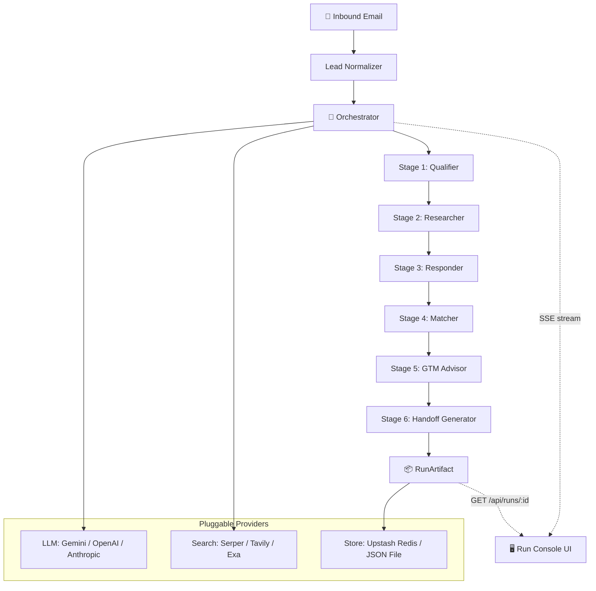

# Inbound BDR Hiring Hackathon

## What I built

A fully autonomous six-stage AI agent pipeline that takes a single inbound contact-form email and produces: a qualification assessment against a dynamically-selected sales framework (MEDDPICC / BANT / SPICED), a live-sourced research dossier with verified claims and provenance, a three-email adaptive response sequence, a case-study match discovered by live-crawling flytbase.com at runtime and scored via a weighted attribute rubric, a GTM motion recommendation (direct AE vs. partner-led), and a structured AE handoff summary.

The system runs end-to-end with zero human intervention — the user clicks "Run Agent Pipeline" and watches all six stages stream results in real time through a purpose-built Run Console UI.

## Why this solves the brief

### Qualify the lead against a sales framework

Stage 1 dynamically selects the best framework (MEDDPICC, BANT, or SPICED) based on the lead's attributes, then scores every slot as known or unknown with verbatim evidence quotes from the email. Outputs a 0–100 priority score with auditable factor breakdown.

### Research the account using real, public data

Stage 2 runs live web searches (Serper/Tavily/Exa), retrieves pages, and builds verified claims across five dimensions (org structure, budget signals, recent news, leadership language, positioning). Every claim carries a source URL, retrieval timestamp, and verification status — nothing is fabricated.

### Draft an adaptive response sequence

Stage 3 generates a three-email sequence where each email references verified research claims, targets unknown qualification slots to elicit information, and includes a progression rationale for why each follow-up is structured the way it is.

### Match the most relevant case study

Stage 4 live-crawls the FlytBase case-studies index at runtime, extracts structured records from each page via LLM, and scores every record against the lead's attributes using a weighted rubric across four dimensions:

- **industry** (0.35) — taxonomy match against lead industry
- **geography** (0.25) — country-to-region match
- **useCase** (0.30) — use-case keyword overlap
- **partnerOverlap** (0.10) — referral/partner name overlap

A committed cached corpus is used only as a labeled fallback when the live crawl fails — affected records are marked `stale`. Outputs the winner, runner-up, and full per-dimension breakdown.

### Recommend the right GTM motion

Stage 5 evaluates whether the deal should go direct-AE or partner-led, considering geography, complexity signals (site count, regulated environment, continuous ops, multi-stakeholder), and any found regional partner evidence.

### Produce a clean AE handoff summary

Stage 6 compiles everything upstream into a structured handoff: buyer context, qualification status, top three verified findings with source links, recommended case study, and a suggested next step consistent with the chosen GTM motion.

---

Every stage validates its output against a strict Zod schema before the pipeline continues. If a stage fails validation, it retries up to three times (with a fallback model on the final attempt). If all retries are exhausted, the stage degrades gracefully to `"unknown"` — the system never fabricates data.

## Architecture / Flow

### How the data flows

1. **Input** — A raw email record (the fixed SQM/Rodrigo Castillo lead, or any email pasted into the Lead Editor).
2. **Lead Normalization** — Extracts sender name, company, title, country, use-case, pain points, referral source, and timeline. Missing fields → `"unknown"`.
3. **Orchestrator** — Runs stages 1→6 in fixed order. Each stage receives a `StageContext` with the lead profile and ONLY the upstream outputs it declared as dependencies. Output is validated against the stage's Zod schema; failures trigger retry with validation feedback.
4. **SSE Streaming** — Every lifecycle event (stage_started, tool_call, reasoning, stage_completed, etc.) is emitted as a Server-Sent Event with a monotonic sequence number. The UI renders each stage panel in real time.
5. **Persistence** — The final `RunArtifact` is stored to either Upstash Redis (durable) or a local JSON file (dev). Stored runs are accessible via permalink at `/runs/{runId}`.

### Anti-fabrication guarantee

The system enforces a strict rule: if a fact cannot be verified from a real source, it resolves to the literal string `"unknown"` rather than a placeholder or hallucinated value. This flows through every layer:

- The `Maybe<T> = T | "unknown"` type system
- The `degradedOutput()` chokepoint in the orchestrator
- The provenance-tracking `FetchLedger` that logs every web fetch with URL, status, and timestamp
- The `LimitationsPanel` in the UI that transparently reports every unknown field

## Evidence from the codebase

### Core pipeline

- `src/agent/contracts.ts` — All TypeScript types: LeadProfile, stage outputs, RunArtifact, Maybe\<T\>
- `src/agent/schemas.ts` — Zod schemas, single source of truth for LLM output validation
- `src/agent/orchestrator.ts` — Run loop with retry, validation, fallback model, event fan-out
- `src/agent/lead-normalizer.ts` — Email → LeadProfile extraction
- `src/agent/fixed-lead.ts` — Hardcoded SQM lead (Rodrigo Castillo, Atacama lithium sites)

### Stage implementations

- `src/agent/stages/stage-1-qualifier.ts` — Framework selection + slot classification + priority scoring
- `src/agent/stages/stage-1/framework-slots.ts` — Static slot sets for MEDDPICC, BANT, SPICED + pure partition function
- `src/agent/stages/stage-2-researcher.ts` — Five-dimension live research with fetch ledger
- `src/agent/stages/stage-3-responder.ts` — Three-email adaptive sequence with claim references
- `src/agent/stages/stage-3/slot-plan.ts` — Deterministic unknown-slot coverage planner across 3 emails
- `src/agent/stages/stage-4-matcher.ts` — Top-level matcher: wires extractor → rubric → ranking into MatchResult
- `src/agent/stages/stage-4/case-study-extractor.ts` — Live crawl of flytbase.com + LLM extraction of CaseStudyRecords
- `src/agent/stages/stage-4/scoring-rubric.ts` — Pure weighted rubric (industry/geography/useCase/partnerOverlap)
- `src/agent/stages/stage-4/ranking.ts` — Deterministic ranking, winner/runner-up selection, deciding dimensions
- `src/agent/stages/stage-4/case-study-serializer.ts` — Round-trip serialization with delimiter escaping
- `src/agent/stages/stage-5-gtm-advisor.ts` — GTM motion with complexity analysis + partner evidence search
- `src/agent/stages/stage-5/gtm-decision.ts` — Pure GTM decision function (complexity scoring, partner-type classification)
- `src/agent/stages/stage-6-handoff-generator.ts` — AE handoff: buyer context, qualification, top-3 findings, case study, next step

### Research infrastructure

- `src/research/toolbelt.ts` — Web search + page retrieval + provenance tracking
- `src/research/fetch-ledger.ts` — Immutable fetch log (URL, status, timestamp, stage)
- `src/research/cached-corpus/` — Committed FlytBase snapshot (fallback only, records marked `stale`)

### Provider adapters (pluggable)

- `src/providers/llm/gemini.ts` — Google Gemini
- `src/providers/llm/openai.ts` — OpenAI GPT + OpenRouter (parameterized, same adapter)
- `src/providers/llm/anthropic.ts` — Anthropic Claude
- `src/providers/llm/throttle.ts` — RPM rate limiter shared across stages
- `src/providers/search/serper.ts` — Serper (Google search)
- `src/providers/search/tavily.ts` — Tavily
- `src/providers/search/exa.ts` — Exa

### Persistence

- `src/store/run-store.ts` — Abstract store interface + serialization
- `src/store/upstash-run-store.ts` — Upstash Redis adapter (durable)
- `src/store/json-file-run-store.ts` — Local JSON file adapter (dev)

### API routes

- `POST src/app/api/run/route.ts` — Triggers pipeline, streams SSE events
- `GET src/app/api/runs/[runId]/route.ts` — Returns stored RunArtifact by ID

### UI layer

- `src/app/page.tsx` — Main Run Console: lead editor, trigger, 6 stage panels, limitations
- `src/app/runs/[runId]/page.tsx` — Read-only stored run viewer (permalink)
- `src/hooks/useRunStream.ts` — SSE consumer + state reducer + artifact hydration
- `src/components/StagePanel.tsx` — Collapsible stage container with status badge
- `src/components/StageEventLog.tsx` — Real-time trace log (LLM calls, tool calls)
- `src/components/SourceLink.tsx` — Verified URL anchor with status + timestamp hover
- `src/components/LimitationsPanel.tsx` — Unknown field transparency report
- `src/components/StreamInterruptedNotice.tsx` — Disconnect recovery (reload + retry)
- `src/components/stage-views/Stage1View.tsx` – `Stage6View.tsx` — Per-stage output renderers

### Testing

- `tests/properties/` — Property-based tests (fast-check): artifact round-trip, framework justification, scoring sensitivity, fetch ledger
- `tests/components/` — React component tests (Testing Library)
- `tests/unit/` — Unit tests for normalizer, orchestrator, providers

## Results

- **Complete type safety** — `npx tsc --noEmit` passes with zero errors under strict mode (`noUncheckedIndexedAccess: true`).
- **Anti-fabrication** — Every `Maybe<T>` field in the UI is narrowed with `!== "unknown"` before property access. The `LimitationsPanel` transparently reports every field that resolved to unknown.
- **Real-time streaming** — The Run Console shows each stage transitioning pending → running → complete/failed in real time via SSE. LLM calls and tool invocations appear in the event log as they happen.
- **Graceful degradation** — If a stage fails after 3 retry attempts (including a fallback model on the last), it degrades to `"unknown"` and downstream stages continue. The run finishes as `partial` rather than crashing.
- **Permalink recovery** — Every completed run is stored and accessible at `/runs/{runId}`. If the SSE stream disconnects, the user can click "Reload Results" to fetch the artifact.

## Approach

1. **Started from the brief** — Read the six requirements (qualify, research, draft, match, recommend, handoff) and mapped each to a pipeline stage with explicit inputs and outputs.
2. **Type-first design** — Defined all data contracts in `contracts.ts` with `Maybe<T> = T | "unknown"` to make the anti-fabrication rule a compile-time guarantee. Zod schemas mirror every type for runtime validation at stage boundaries.
3. **Deterministic pipeline** — Six stages run in fixed order (not an LLM-driven agent loop), so the system is predictable, auditable, and debuggable. Each stage declares its upstream dependencies explicitly.
4. **Pluggable providers** — LLM (Gemini/OpenAI/Anthropic/OpenRouter), search (Serper/Tavily/Exa), and storage (Upstash/JSON) are swappable via environment variables — no code changes needed.
5. **Real-time transparency** — The SSE stream + Run Console UI lets a reviewer watch the agent think: every LLM call, web search, and validation error is visible. Framework justification, scoring rubric breakdown, and email progression rationale are rendered as visible text — never hidden behind a debug toggle.
6. **Property-based testing** — Used fast-check for invariant testing: artifact round-trip serialization fidelity, framework justification attribute deduplication, scoring sensitivity bounds, fetch ledger immutability.

## Notes

- Brief: We are hiring a founding inbound BDR who can build, not just execute. This assignment tests whether you can design and ship a working AI agent that qualifies, researches, and routes inbound leads automatically — the same workflow a human BDR would perform, but systematized and scalable.
- The system is built with Next.js 15 (App Router) + TypeScript + React 19, deployed as a single fullstack app.
- The fixed lead (Rodrigo Castillo, SQM, Atacama lithium sites) is included as the default, but the Lead Editor allows submitting any arbitrary inbound email.
